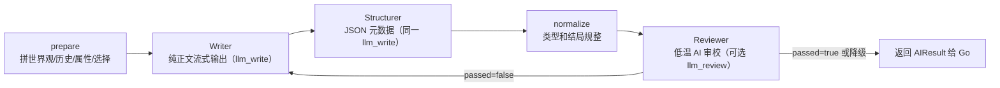

# Story Editor · Agent 服务

> Python FastAPI 服务。职责是把“世界观 + 剧情路径 + 当前状态 + 玩家行动”**流式**转换为**经 AI 质量审校的结构化剧情结果**。生成编排是单条自研流水线 `_stream_pipeline`（未用 langgraph）。它是独立进程，**不访问 PostgreSQL，也不持久化任何剧情数据**；Go 后端是唯一的调用者和写库者。

## 先了解什么

- 项目全局状态和接手方式：[开发交接手册](../docs/handoff.md)
- 后端与 JSONB 状态约定：[CLAUDE.md](../CLAUDE.md)
- 长程剧情记忆方案：[剧情上下文构建方案](../docs/context-strategy.md)

## 职责与边界

| Agent 负责 | Agent 不负责 |
|---|---|
| 构建 LLM 上下文、生成剧情 JSON、审校质量、规整模型输出 | 数据库、会话归属、状态持久化、鉴权、前端展示 |
| 生成正文、选项、`state_delta`、滚动 `summary` | 合并 `state_delta`、创建 StoryNode、更新 PlaySession |
| `/assist/*` 创作辅助和 `/merge-check` 语义判断 | 决定是否复用节点、执行业务权限 |

Go 侧契约实现位于 `backend/internal/service/agent_client.go`；游玩调用方是 `backend/internal/service/play.go`。

## 目录与入口

```text
agent/
├── app/
│   ├── main.py                  # FastAPI 装配、/health
│   ├── config.py                # .env / 环境变量配置
│   ├── llm.py                   # OpenAI 兼容客户端：chat_stream 流式 + chat_json；凭据随请求下发
│   ├── prompts.py               # 生成、审校、创作辅助、合并判断提示词
│   ├── schemas.py               # 与 Go 对齐的 Pydantic 请求/响应模型
│   ├── graph/
│   │   ├── state.py             # 生成流水线共享状态（TypedDict）
│   │   └── story_graph.py       # 流式生成编排 _stream_pipeline + prepare/normalize/review
│   └── routers/
│       ├── generate.py          # /generate/stream、/continue/stream、/opening/complete、/merge-check
│       └── assist.py            # /assist/*
├── tests/
│   ├── test_stream.py          # 流式管线与 reveal 门控：正文写作/结构化/审校/降级
│   ├── test_llm_parse_retry.py # parse 重试恢复/耗尽
│   └── test_assist_polish.py   # 深度润色：审校/一次润色/复审/关键回退
├── .env.example
└── requirements.txt
```

## 核心工作流：正文写作、结构化与审校分责



### 节点职责

1. `prepare`
   - 开局：写入世界观、初始状态、属性类型。
   - 续写：写入节点路径、最近滚动摘要、最近原文、当前状态与玩家选择。
   - 锁定允许出现在 `state_delta` 中的属性键和类型。

2. `Writer` / 写手
   - 调用 `STORY_WRITER_SYSTEM` 和 `chat_stream`，只流式输出可直接展示给玩家的纯正文；不输出 JSON、选项、属性变化、摘要、哨兵或解释。
   - 审校失败时用**有记忆的写手**修订：把上一稿 + `issues` 追加进写手对话（`writer_msgs`），令其在上一稿上**修订**而非从头重写（减少震荡、更快收敛）。

3. `Structurer` / 结构化助手
   - Writer 结束后调用 `STRUCTURE_SYSTEM` 和 `chat_json`，根据已写定的正文输出 `options`、`state_delta`、`summary`、结局字段及 `revealed`。
   - 与 Writer 共用同一 `llm_write` 配置；正式 `usage.write` 是两次调用的累计值，不新增第三套模型设置或计费阶段。
   - 只提取正文中已经成立的事实，不改写、续写或补充正文。

4. `normalize`
   - 每个候选在审校前规整选项为 `{text}`（主动剥离 hint——选项只给行动文字），过滤非法属性键，按 `number/scalar/set` 类型规整 delta，并修正非法 `ending_type`。

5. `Reviewer`
   - 若作品启用质量审校，调用低温 `REVIEW_SYSTEM`，返回 `{"passed": true|false, "issues": [...]}`；未配置 `llm_review` 时只跳过本节点，不跳过 Structurer。
   - 审查世界观/历史承接、属性入戏、剧情推进、选项差异和后果、`state_delta`、`summary` 与结局一致性。

### 重试边界

`AI_REVIEW_MAX_RETRIES` 控制审校拒绝后允许的**额外重写次数**，默认 `2`。

- 启用审校的首稿通过：Writer × 1 + Structurer × 1 + Reviewer × 1。
- 关闭审校：Writer × 1 + Structurer × 1，仍返回完整的选项、状态和摘要。
- 连续失败：最多“初稿 + 2 次重写”；每次重写都完整执行 Writer → Structurer → Reviewer，禁止新正文沿用旧结构化结果。
- 超过上限：**降级交付最后一稿**（`deliver_degraded` 节点，打 `degraded=1` 埋点），**不再硬失败**。理由：属性/state_delta 只是辅助 AI 分析与玩家参考的手段，轻微不精确可容忍；宁可交付略有瑕疵的剧情，也绝不让玩家的操作失败。

审校采**分级**（`REVIEW_SYSTEM`）：只拦阻断级硬伤（正文与设定/前情/选择直接矛盾、正文无推进、非结局无选项/选项雷同、summary 篡改关键不可逆事实、JSON 结构坏）；delta 数值精度、未遂动作是否记账等模糊情形一律放行。这是刻意的有限循环：无限“直到合格”会在模型自我否定时耗尽费用与时间。

### 埋点（可观测性）

`story_graph.py` 打两类 `story.metrics` 日志（logfmt）：

- `gen` —— 每次生成流一行：`mode`、`outcome`、`elapsed_ms`、成功附 `review_failures`(0=首稿通过)/`first_draft_pass`/`degraded`(是否超限降级交付)/`is_ending`，失败附 `err_type`/`detail`。`outcome` 细分 `ok`(含降级交付)/`parse_error`(LLM 非法 JSON)/`error`；审校超限**不再算失败**，以 `ok degraded=1` 交付并另打一行 `review degraded ...` WARNING，无 `review_exhausted`。
- `review` —— 每次审校判定一行：`verdict`(pass/reject)、`attempt`、拒绝附 `issues`。

用 `tools/sample_metrics.py [每世界续写轮数]` 在进程内直驱采样并聚合（不经 HTTP、不碰 DB，避免 uvicorn 吞掉 INFO；会真实调用 DeepSeek）。需要人工复盘一部真实作品的正文、摘要、选项、属性、SSE `revise`、首字时间与阶段 usage 时，用 `tools/playtest.py --write-config-file C:/secure/write.json [--review-config-file C:/secure/review.json]`；写手配置同时供 Writer 与 Structurer 使用，输出的 `write` usage 是两者累计，`review` usage 仅来自 Reviewer。两份显式配置均不入库，省略 review 配置只关闭审校、不关闭结构化。背景与取舍见交接手册 §9.1。

## 长程记忆与 `summary`

每个成功生成的剧情节点都包含滚动 `summary`。Go 将它持久化到 `story_nodes.summary`，下一次续写会把历史中最近非空摘要写为 `【前情提要】`，再补最近 2 段原文。

```text
优先：最新 summary + 最近 2 段原文 + 当前状态/选择
兜底：老节点没有 summary → 开局 + 最近 HISTORY_WINDOW 段原文
```

- `summary` 必须保留关键人物、关系、地点/物品、伏笔和不可逆事件。
- 它是有损压缩，可能漂移；复杂支线后续再用 RAG 补精确细节。
- 详细权衡在 [剧情上下文构建方案](../docs/context-strategy.md)。

## 运行

### 配置

```bash
cd agent
copy .env.example .env  # Windows；可选，全部变量都有默认值
```

> **agent 不持有任何 LLM 凭据。** key / 端点 / 模型名由 Go 后端按环节解析后随每个请求
> 下发（玩家自带连接，或平台额度）。请求里没带配置就是硬错误（`LLMConfigMissing`），
> 不会回退到某个默认 key —— 那样等于让服务器悄悄替用户付费。

| 变量 | 默认 | 说明 |
|---|---|---|
| `AI_TEMPERATURE` | `0.8` | 正文生成随机性 |
| `AI_TIMEOUT` | `60` | 单次 LLM 调用超时（秒） |
| `AI_REVIEW_MAX_RETRIES` | `2` | 审校拒绝后的额外重写/修订次数 |
| `AI_WRITE_MAX_TOKENS` | `1500` | 写手输出上限（token，0=不设）——防复读失控的成本安全帽 |
| `AI_STRUCTURE_MAX_TOKENS` | `1200` | 结构化（options/state_delta/summary）输出上限 |
| `AI_REVIEW_MAX_TOKENS` | `800` | 审校 JSON 输出上限 |
| `AI_PARSE_MAX_RETRIES` | `1` | LLM 返回非法 JSON 时的附加重试次数 |
| `HISTORY_WINDOW` | `8` | 老数据无摘要时的滑动窗口大小；`<=0` 为全量历史 |

### 启动与检查

```powershell
# Windows
.\.venv\Scripts\python.exe -m pip install -r requirements.txt
.\.venv\Scripts\python.exe -m uvicorn app.main:app --host 0.0.0.0 --port 8001 --reload

# 或从仓库根启动全部服务
..\scripts\dev.ps1 -Only agent
```

- 健康检查：`GET http://localhost:8001/health`
- OpenAPI：`http://localhost:8001/docs`

## 接口

| 方法 | 路径 | 调用方 / 作用 |
|---|---|---|
| `POST` | `/generate/stream` | Go `StartStoryStream`：流式开场（AI 生成开局的作品） |
| `POST` | `/continue/stream` | Go `ContinueStream`：流式续写 |
| `POST` | `/opening/complete` | Go `StartOpeningStream`（预设 `opening_content` 的作品）：补起始选项 + summary |
| `POST` | `/merge-check` | Go `tryMerge`：候选分支语义等价判断 |
| `POST` | `/assist/world` | 创作辅助：灵感 → 世界观/属性声明/文风档案 |
| `POST` | `/assist/opening` | 创作辅助：世界观 → 开场草稿 |
| `POST` | `/assist/polish` | 创作辅助：完整开场正文的深度润色闭环 |
| `POST` | `/assist/branches` | 创作辅助：分支建议 |
| `GET` | `/health` | 进程存活探针（不报告模型配置——agent 不持有任何凭据） |

`/generate` 与 `/continue` 的成功响应：

```json
{
  "content": "剧情正文",
  "options": [
    {"text": "正面交涉"}
  ],
  "state_delta": {"hp": -10},
  "summary": "截至本段的前情提要",
  "revealed": [],
  "is_ending": false,
  "ending_type": ""
}
```

> `revealed`：本段揭示的「揭示门控」属性键（`world_config.attributes[k].reveal=true`，玩家发现前不显示）。请求可带 `revealed_attrs`（已揭示集合），`prepare`/`_write_reveal_gated` 据此把未揭示项注入提示，`normalize` 按声明白名单校验 `revealed`。详见交接手册 §5.3。

真失败（LLM 非法 JSON 重试耗尽、网络/API 异常）：流式端点以 SSE `error` 帧告知，`/opening/complete`·`/merge-check` 返回 HTTP 502。审校超限**不算失败**（降级交付最后一稿）。

### 流式（SSE）

`/continue/stream` `/generate/stream` 返回 `text/event-stream`，帧格式：

```
event: delta   data: {"text":"增量正文"}     # Writer 的正文逐字外发
event: revise  data: {}                       # 审校拒绝 → 下游清空已流出正文，准备重来
event: done    data: {<完整 AIResult>}        # 结束，携带 content/options/state_delta/summary/...
event: error   data: {"detail":"...", "usage": {...}}  # 流已开始，异常只能以 error 帧告知；
                                                       # usage 可选携带失败前已烧掉的 token（与
                                                       # done 帧同构），Go 失败路径据此记账
```

实现：Writer 先流式输出纯正文；结束后由复用同一 `llm_write` 配置的 Structurer 生成 JSON 元数据，再规整并执行可选 review。拒绝时发 `revise`，并完整重跑 Writer → Structurer → Reviewer（上限 `AI_REVIEW_MAX_RETRIES`）；Writer/Structurer 的累计用量回传为 `usage.write`。失败路径的已烧 usage 由 `StreamPipelineError` 携带、随 error 帧带出；`chat_stream` 的 usage 累加在 `finally` 里，断连/取消不漏账。各环节输出上限由 `AI_WRITE/STRUCTURE/REVIEW_MAX_TOKENS` 控制（成本安全帽，0=不设）。见 `graph/story_graph.py` 的 `_stream_pipeline`。埋点在成功时多打 `stream=1 depth=<history 长度> ttfb_ms=<首字延迟>`。

### 作者侧深度润色

`POST /assist/polish` 是独立、非流式的作者工具，不能调用 `story_graph` 或影响玩家 SSE / Hard Review。请求只从 `world.style_profile` 读取可选档案，不接受顶层 `style_profile`：

```json
{
  "text": "完整开场正文",
  "instruction": "可选本次目标",
  "world": {
    "style": "自由文风说明",
    "style_profile": {
      "narrative_distance": "close",
      "rhythm": "tight",
      "sensory_focus": ["雨声"],
      "dialogue_rule": "对白保留试探",
      "avoid": ["直接解释情绪"]
    }
  }
}
```

档案缺省时兼容旧作品；`sensory_focus` 最多 3 条、`avoid` 最多 5 条，两个枚举分别为 `close|medium|distant` 与 `mixed|tight|relaxed`。流程固定为初审 → 至多一次润色 → 复审：初审没有 major 问题，或复审未至少提升 5 分、仍有 major、丢失事实/画面锚点、候选空/长度不合法、内部模型或 JSON 异常时，逐字返回原文并 `applied=false`。默认候选长度为原文的 75%–125%，仅当 `instruction` 明确要求扩写或压缩时放开。

响应为 `{text, applied, feedback, usage}`：`feedback` 最多两条 `{category, span_hint, goal}`，类别仅为 `ai_tell|rhythm|dialogue_voice|style_drift|redundancy`；`usage` 是 Agent→Go 的内部累计计费数据，编辑器不展示。`applied=true` 只表示复审建议作者采纳，前端必须由作者显式替换正文。

离线盲选使用 `tools/style_polish_cases.json` 的 8 个原创场景：

```powershell
.\.venv\Scripts\python.exe tools/style_polish_ab.py --llm-config-file C:/secure/llm.json
```

每场景 3 次，共 24 对，A/B 位置随机，输出与 mapping 写入已忽略的 `tools/out/`。人工只可二选一，并按自然度、人物声音、具体性、节奏打分；验收门槛为 Candidate 至少胜 15/24 且夹具 anchors 零丢失。

## 属性类型契约

创作者可通过 `world_config.attributes` 声明属性类型。Agent 的生成和 `normalize` 必须遵守：

| 类型 | 合法 delta | 示例 |
|---|---|---|
| `number` | 数值增减 | `{"hp": -10}` |
| `scalar` | 新值覆盖 | `{"location": "王城"}` |
| `set` | `add/remove` | `{"items": {"add": ["钥匙"], "remove": ["火把"]}}` |

未声明属性类型的老作品仍可工作：Agent 透传，Go 的 `mergeState` 负责兼容推断。修改这里时必须同时检查 `agent/app/schemas.py`、`backend/internal/service/agent_client.go` 和 `backend/internal/service/play.go`。

## 测试与修改清单

```powershell
cd agent
.\.venv\Scripts\python.exe -m compileall -q app tests
.\.venv\Scripts\python.exe -m unittest discover -s tests -v
```

当前 `tests/test_stream.py`、`tests/test_llm_parse_retry.py` 与 `tests/test_assist_polish.py` 保留十五个关键回归测试：

- 正常流式回合、审校重写、耗尽降级与关闭审校；
- JSON 重试和无默认凭据；
- 润色闭环的未触发、采用、复审回退与预调用预算保护。
修改 Agent 时还必须在真实环境连续试玩：检查上下文是否正确、摘要是否漂移、选项后果是否兑现、审校重写率与延迟是否可接受。
