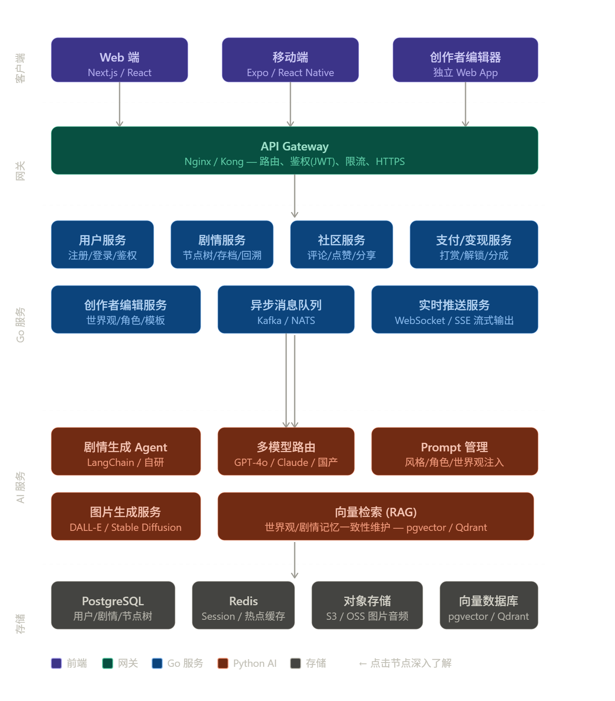
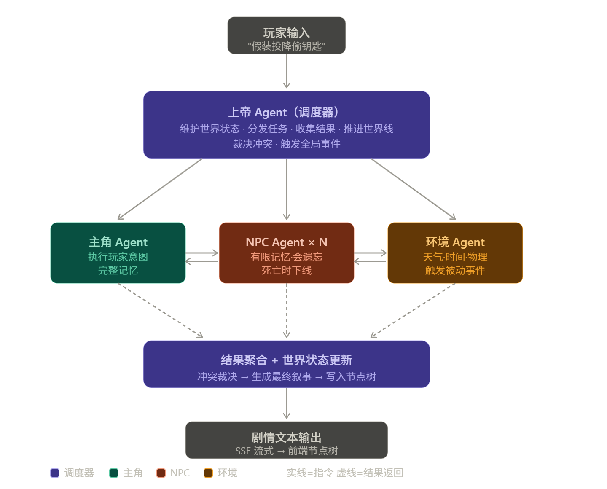

> 📖 **本文为技术设计（思路 / 实现）**：技术选型、剧情树与 JSONB、属性类型、数据流、扩展。产品需求见 [prd.md](prd.md)，仓库总览见 [README.md](../README.md)。
>
> **阅读提示（2026 年 7 月 28 日）**：本文保留了早期架构设想与后续演进方案。当前可运行事实、代码入口和接手优先级以 [handoff.md](handoff.md) 与 `CLAUDE.md` 为准；尤其“前端尚未搭建”“未来多 Agent”等早期表述不能直接视为现状。
初期的话，先做一个最小的MVP，内容为剧情游玩
具体功能设计详见 **prd.md**。
首先是技术选型

**目标/愿景架构**（下图是长期目标形态，含 API 网关、微服务拆分、消息队列、多模型路由、RAG、对象存储等——**当前均未实现**）。**当前实际架构**是 Next.js 前端 → Go 单体（`handler→service→repository`）→ Python FastAPI（单 `_stream_pipeline`）→ DeepSeek + PostgreSQL，见 [README.md](../README.md) 与 [handoff.md](handoff.md)。



> **目录结构**：当前真实目录树与分层约定见 [`../CLAUDE.md`](../CLAUDE.md)「分层架构」（此处原早期目录草图已过时删除）。

## 前端

前端的话大概是 **Next.js + React**，状态管理用 **Zustand** ，对前端不了解，等后端基础些差不多了再写。

## 后端

后端的话考虑用 **Go-Gin** 做基础的后端服务

> **架构定位（重要）**：下面这几个 “service” 是**逻辑模块划分 / 未来的微服务拆分方向**，不是一开始就拆成多进程。
> MVP 阶段落地为**单个 Go 单体**（`handler → service → repository` 扁平分层，各模块是同一进程内的包），等某个模块真正成为瓶颈再独立拆分。
> **唯一从一开始就独立进程的是 Python AI 服务**（Go 通过 HTTP/SSE 调用，见 `agent_client.go`）。

`user-service` 注册/登录/JWT/OAuth（微信登录）

`story-service` 节点树CRUD、存档、回溯、分支统计

`community-service` 作品发布、点赞、评论、搜索

`payment-service` 打赏、解锁节点、收益分成

`realtime-service` WebSocket/SSE，把AI流式输出推给前端

## AI agent

Ai相关服务单独分出来用 **Python - FastAPI** 做 ai 服务。

> 早期设想用 LangGraph 编排；**实际落地为轻量自研流式流水线 `_stream_pipeline`**（未引入 langgraph），见下文与 `agent/README.md`。

Agent 架构图（**目标多 agent 形态·愿景**：上帝 agent 调度 + 主角/NPC/环境子 agent 并行归纳。**当前未实现**——现为单条 `_stream_pipeline`：prepare → 流式写作 → normalize → review，见 [handoff.md](handoff.md) 与 `agent/README.md`）。落地阶段见下文「目标形态与落地阶段」。



用户提问后，请求转发给上帝agent模块进行调度，rag检索上下文，找到选择相关的人物，派发子agent进行

子agent接受到任务后，检索相关信息，根据人物设计处理，返回结果给上层。

主agent接受到返回的结果，进行归纳统计，判断剧情是否达标，负责进行重试。合格后存储到数据库，返回原始数据给模块，调用ai编排成文段返回给前端

### 目标形态与落地阶段

上面「上帝 agent 调度 + 按人物子 agent + 主 agent 归纳」是**目标演进形态**。落地策略：**先采纳「角色分工」精神做流水线式子图，把最贵的「按人物并行 fan-out」推到最后**——对外 `run_start / run_continue` 签名始终不变（把 `generate` 节点替换为子图即可）。

目标子图（替换 `generate`）：

```
prepare
  ↓
① director  导演/节拍：读 current_state+进度 → 定本回合节拍(铺垫/冲突/收束)、
            消费硬规则(数值属性极端→险境/结局)、给出期望选项方向   ← 「上帝 agent 调度」
  ↓
② recall    记忆检索：从节点树增量摘要 + 关键事实(伏笔/人物关系/死亡)
            检索与本次选择相关的条目                              ← 「RAG 检索 + 定位人物」
  ↓
③ write     叙事生成：beat + 记忆 + 属性 → 正文(引用属性)、分化选项(纯行动文字，不预告后果)、state_delta
  ↓
④ critic    一致性校验 + 归纳：与记忆/世界观冲突则重写；抽取本段新增关键事实回填节点摘要 ← 「主 agent 归纳」
  ↓
normalize
```

三阶段演进（成本换体验，逐步逼近上图）：

- **阶段一（已完成）｜生成质量闭环 + 流式**：Writer 只流式产出节拍把控的正文；随后同一 `llm_write` 配置下的 Structurer 根据已写正文产出选项、属性变化、结局与滚动 `summary`。`summary` 落库到 `story_nodes.summary`（即「④节点树增量摘要」，见 [context-strategy.md](context-strategy.md)），续写时作【前情提要】喂回。**已含流式**：正文以 SSE 逐字流出（详见下「流式生成与质量策略」）。生成后低温 `review` 审查承接/属性/选项后果/delta 与摘要一致性，拒绝则完整重跑 Writer → Structurer，并由**有记忆写手在上一稿上修订**，**超限降级交付最后一稿**（不硬失败）。另含**故事大纲导演**（outline）、**隐藏属性**（hidden，仅供 AI 参考不泄漏给玩家）、审校**分级**（只挡硬伤）。
- **阶段二（部分完成）｜拆真节点 + RAG**：Writer / Structurer 的最小职责拆分已在阶段一落地；剩余为 director、recall、critic 等职责独立节点，以及将 recall 从节点摘要升级到 RAG（③）。
- **阶段三｜按人物 fan-out**：多 NPC 同场时并行派发人物子 agent，主 agent 归纳——补齐完整多 agent 形态。

> 当前 `agent/` 生成编排是**单条 `_stream_pipeline`（真流式）**：`prepare → Writer（chat_stream 逐字正文）→ Structurer（同一 llm_write 的 JSON 元数据）→ normalize → 可选 review`，拒绝则完整重跑 Writer → Structurer → Reviewer，并有记忆修订、超限降级交付。历史上的 langgraph 非流式图已退休；`prepare`/`normalize`/`review` 为共享纯函数（见 [agent/README.md](../agent/README.md)、`prompts.py`）。尚未拆出 director/recall/critic 的完整子图。

### 流式生成与质量策略（当前实现的关键设计决策）

**为什么流式**：完整生成 + 审校约 7~8s，玩家点选项后要等这么久才见字。改为正文逐字 SSE 后**首字延迟降到 ~1s**，遮住尾延迟。

**写作 / 结构化分责**：Writer 一次 `chat_stream` 只输出正文并逐字外发；正文结束后 Structurer 以 `chat_json` 根据该正文生成 `options`、`state_delta`、`summary` 等 JSON。两阶段共用同一 `llm_write` 配置，正式 `usage.write` 聚合两次调用，不新增模型设置或计费阶段。这样不再要求流式模型生成可解析的 JSON 尾；代价是正文流完后多一次结构化调用，增加尾延迟与 write 成本，但首字不受阻塞。

**SSE 契约**（前端 ← Go ← agent，全程不缓冲）：
```
event: delta   data: {"text":"增量正文"}
event: revise  data: {}                  # 审校拒绝 → 前端清空已流出正文，准备重来
event: done    data: {<完整结果>}         # agent→Go 为 AIResult；Go→前端为持久化后的 SessionResult
event: error   data: {"detail":"…"}
```

**落库时序约束**：状态合并（`mergeState`）、同层去重（`tryMerge`）、写节点 + 更新会话**只能在流结束拿到完整结果后做**——它们依赖完整的 delta/options/summary，不能在流中途做。

**质量策略（容忍瑕疵 > 让玩家失败）**：
- **审校分级**（`REVIEW_SYSTEM`）：只挡阻断级硬伤（正文矛盾/无推进/无选项/summary 篡改关键事实/JSON 坏）；delta 精度、未遂动作记账等模糊情形一律放行。
- **有记忆写手修订**：审校拒绝时把「上一稿 + issues」追加进写手对话（`writer_msgs`），令其在上一稿基础上**修订**而非从头重写——减少来回震荡、更快收敛。审校本身无记忆、每次新鲜评判。
- **超限降级交付**：达 `AI_REVIEW_MAX_RETRIES` 仍未过，则交付最后一稿（打 `degraded=1` 埋点），**绝不硬失败**。理由：属性/`state_delta` 只是辅助 AI 分析与玩家参考的手段，轻微不精确可容忍，但玩家的操作失败不可接受。真失败只剩「LLM 非法 JSON 重试耗尽 / 网络异常」。

**隐藏属性**（`attributes[k].hidden`）与另两个标记：见下文「属性类型分类 → 三个可选标记」。agent 侧的落点是 `_write_hidden`。

## 数据库设计

PostGreSQL

一局游戏的剧情树长这样：

```
根节点（开局）
├── 选择A → 节点1
│   ├── 选择A1 → 节点3
│   └── 选择A2 → 节点4（结局）
└── 选择B → 节点2
    └── 选择B1 → 节点5
```

每个节点需要记录：**它是谁生的（parent）、玩家做了什么选择、这一步属性怎么变了(可省略)，原始数据，返回给用户的段落**。

---
建表详见/infa/sql
## 递归 CTE 查询

建好表之后，PostgreSQL 的递归 CTE 可以直接处理树形查询，不需要应用层递归。

## JSONB 的扩展能力

这是支持创作者自定义属性的关键。创作者可以在 `world_config.initial_state` 里定义任意字段：

```json
// 创作者A的武侠世界
{ "hp": 100, "inner_power": 80, "reputation": 0 }

// 创作者B的商战故事
{ "money": 1000000, "connections": 5, "public_opinion": 50 }

// 创作者C的恋爱养成
{ "affection_A": 0, "affection_B": 0, "looks": 70 }
```

`story_nodes.state_delta` 存对应的增量，`play_sessions.current_state` 存累加后的完整状态，**整套逻辑对创作者的字段名完全透明**，后端代码不需要知道有哪些属性，直接做 JSONB 合并就行。

查询某个属性也很方便：

```sql
-- 查某个session当前的好感度
SELECT current_state->>'affection_A' FROM play_sessions WHERE id = :id;

-- 查所有好感度超过80的session（用于触发隐藏剧情）
SELECT id FROM play_sessions
WHERE (current_state->>'affection_A')::int > 80;

-- 给JSONB字段加索引，查询不慢
CREATE INDEX idx_session_state ON play_sessions USING GIN(current_state);
```

---

## 属性类型分类（增量语义的边界）

> 本节是属性系统的**权威说明**。`CLAUDE.md` 只保留必须每次遵守的不变式，细节看这里。

属性完全由创作者定义，**后端不硬编码任何字段**。前面的 delta 累加只演示了 `hp/gold` 这类数值属性，但创作者还会定义背包道具、布尔开关、身份标签，这些无法用「加减」表达。所以类型要在 `world_config.attributes` 里逐键声明，它同时决定 **AI 必须产出的 delta 格式**与**后端的合并策略**：

| 类型 | 例子 | delta 语义 | 合并方式 |
|------|------|-----------|----------|
| **number** | `hp`、`gold`、好感度 | `{"hp": -10}` 表示增减 | 路径累加 / 数值相加 |
| **scalar** | `location`、`chapter`、布尔 flag | `{"location": "王城"}` 表示置为新值 | 后值覆盖前值 |
| **set** | 背包 `items`、已解锁成就 | `{"items": {"add": ["钥匙"], "remove": ["火把"]}}` | 按 add/remove 增删元素，去重 |
| *未声明* | — | — | 两边都是数字→相加，否则覆盖（兼容早于 `attributes` 的老作品） |

```jsonc
// world_config.attributes 声明（供后端选择合并策略、前端渲染面板）
{
  "hp":      { "type": "number", "initial": 100, "max": 100 },
  "items":   { "type": "set",    "initial": [] },
  "married": { "type": "scalar", "initial": false }
}
```

**两处实现必须对齐**：Go 的 `service.mergeState`（`play.go`，类型取自 `WorldConfig.AttrTypes()`）与 agent 的 `normalize`（`graph/story_graph.py`，它还会丢弃非法键）。`backend/internal/service/play_merge_test.go` 是契约测试——改了任一边就跑它。

> 关键结论：**只有 number 能用 SQL `SUM` / 路径累加**；scalar 和 set 必须靠 `state_snapshot`（每节点完整快照）回溯，无法从 delta 反推。这才是保留 `state_snapshot` 的根本原因，不只是性能优化。

### 三个可选标记

- **`"hidden": true`** —— 只给 AI 看的幕后仪表（怀疑度、天命）。照常并入 `current_state`、照常喂给 agent，区别在于前端 `AttrBar` 过滤掉它，且提示词要求 LLM 可以据此把控走向、**但不得在正文或选项里点名或报数**，只能通过叙事间接透出。
- **`"reveal": true`** —— **在剧情让玩家发现之前**隐藏，之后显示；是一种由 AI 控制的、按会话计的可见性。数值全程照常跟踪，被门控的只有显示。状态存在 `play_sessions.revealed_attrs` + `story_nodes.revealed_snapshot`（按节点存，所以**回溯到发现之前会重新隐藏**）。写手产出 `revealed: [...]` 列表，`normalize` 按已声明的 reveal 键做白名单过滤，Go 侧做并集。`AttrBar` 的显示条件是 `非 hidden ∧ (非门控 ∨ 已揭示)`。这条机制是开场不会一次性剧透 `initial_state` 全部属性的原因。
- **`"max": <正数>`**（仅 `number`）—— 纯**显示**上界：`AttrBar` 只对声明了它的键画进度条，其余显示纯数字。没有声明上界就没有「满」的含义——曾经硬编码 0–100，结果 `gold: 500` 永远满、`affinity: -20` 永远空，比不画还误导。不参与合并，不下发给 agent。由 `pkg.ValidateWorldConfig` 规则 8 约束。**没有 `min`**，代码里从不存在这个键。

对非作者，两侧都要挡住：作品详情剥掉 `hidden` 的整条声明与未揭示 `reveal` 的初值（`service/access.go` 的 `sanitizeWorldConfig`），游玩接口剥掉对应的实时数值（`service/player_view.go` 的 `attrView`，节点按自身 `revealed_snapshot`、会话按 `revealed_attrs`）。只做一边等于没做——光挡声明，玩家从 `current_state` 照样读得到。作者玩自己的作品不脱敏。

### 题材标签（`world_config.tags: string[]`）

`tags[0]` 是主题材（首页筛选 chip 按它分组），其余是纯展示标签。**必须与 `theme` 区分开——`theme` 只挑配色皮肤**：曾经拿主题的显示名当题材用，于是出现《孤岛探案》被标成「恐怖 · 怪谈」的卡片。`lib/types.ts` 里的 `GENRES`/`TONES` 是建议列表而非白名单，列表外的标签往返不会被改写。

> `world_config` 的未知键原样透传（Go 的 `worldConfigShape` 结构体忽略它们）。这就是 `theme`/`tags` 零后端改动的原因——加字段前先想想能不能用它。

### 三份状态数据的一致性约定

`state_delta`（增量）/ `current_state`（会话全量）/ `state_snapshot`（节点全量）三者并存，必须约定单一事实来源，否则极易不一致：

- **`play_sessions.current_state` 是当前状态的唯一事实来源**，前端属性面板只读它；
- `story_nodes.state_delta` 是审计与展示「这一步变化了什么」的依据；
- `story_nodes.state_snapshot` 是回溯加速缓存（回溯 = 直接用它覆盖 `current_state`）；
- 三者**必须在同一数据库事务内写入**（写节点 + 更新会话），不允许分开提交。

## 回溯功能怎么实现

玩家点击"回到第3步重新选择"，不需要删数据，直接：

```sql
-- 1. 找到目标节点
-- 2. 以它为parent_id插入新节点，depth = target.depth + 1
-- 3. 把session的current_state回滚到目标节点的状态

-- 回滚状态：重新跑一遍路径累加，或者在节点上缓存一份snapshot
-- MVP阶段简单做：在节点上加一个 state_snapshot 字段存当时的完整状态
ALTER TABLE story_nodes ADD COLUMN state_snapshot JSONB;
-- 每次写节点时把当前完整状态快照进去，回溯时直接读这个
```

用 `state_snapshot` 是空间换时间，每个节点多存一点数据，但回溯时不需要递归重算，直接读就行。

### 已生成节点必须复用（AI 随机性问题）

AI 生成有随机性（`temperature` 较高时同一输入结果不同），所以要区分两种操作，否则"对比不同选择""重玩分支"会失真：

- **查看/回到已存在的节点** → 直接读数据库里已落库的 `content`，**绝不重新请求 AI**（保证玩家看到的分支内容稳定、可对比）；
- **在某节点探索一个全新选择** → 才调用 AI 生成并作为新子节点落库。

即：树上每个节点的 AI 内容**生成一次、永久固化**。这也让「XX% 玩家走过此路线」的统计有意义。

---

## 路径统计（热门节点）

```sql
-- 统计某个作品哪些节点被最多玩家经过
-- visit_count 在节点被其他玩家"走到"时+1
SELECT
    id,
    choice_text,
    content,
    visit_count,
    depth
FROM story_nodes
WHERE story_id = :story_id
  AND is_public = true
ORDER BY visit_count DESC
LIMIT 20;
```


------

## 扩展性（留待真实瓶颈，当前 0 用户不做）

规模估算：10 万玩家 × 500 节点 ≈ 5000 万行，5 亿行是百万级用户量级——**都不是现在的问题**。

**当前只需一件事**：`story_nodes` 必须命中 `(session_id, parent_id)` 索引（见 `infa/sql/play.sql`），杜绝全表扫描——按 session 取树、递归 CTE 回溯路径都走它，5 亿行与 500 万行都是毫秒级。`state_snapshot` 另把回溯从「递归 CTE 累加」变成「一次主键查询」，顺带是深剧情的性能优化。

**真出现瓶颈时的分层方案**（都对应用透明、按需逐层上，勿过早优化）：按 `story_id` 哈希分区表 → 90 天冷热数据分离 → 读写分离（只读副本渲染时间线/统计）→ 单表超 10 亿行考虑 TiDB；写 QPS 过高走消息队列缓冲、热门计数走 Redis。**MVP 只做索引层**。


## 关键数据流与前后端契约

以「玩家做出一次选择」为例，端到端**流式**链路（P0 核心）：

```
前端                     Go 后端                        Python AI 服务
 │ POST /choice/stream (SSE) │                              │
 │ ────────────────────────> │ 1. 校验会话、递归 CTE 回溯 history │
 │                           │ 2. ContinueStream ─────────> │ prepare→Writer 逐字写正文
 │      delta 正文增量 ◀──────┼──── SSE delta 逐帧转发 ◀──────┤   (纯正文)
 │      (revise 时清空重来)    │                              │ 结束: Structurer→normalize→review
 │                           │ 3. 流结束拿到完整 AIResult:   │   (拒绝→完整重跑 Writer/Structurer→降级)
 │                           │    mergeState → tryMerge 去重 │
 │                           │    事务: INSERT 节点 +        │
 │                           │          UPDATE 会话          │
 │ done: 持久化后 SessionResult ◀─┤                          │
```

**契约要点**：
- AI 服务只负责「给定世界观 + 历史路径 + 玩家输入 → 流式返回正文 + `{options, state_delta, summary, …}`」，**不碰数据库**（`agent_client.go`：非流式用带 90s 超时的 client，**流式用无超时 client + ctx 控时**）。`options` 落库到 `story_nodes.suggested_options`。**落库/去重只能在流结束后做**（依赖完整结果）。
- 属性状态的**唯一事实来源是 `play_sessions.current_state`**；`state_delta` 是审计/回溯依据，`state_snapshot` 是回溯加速缓存。三者必须在同一事务写入，见本文「三份状态数据的一致性约定」一节。
- 回溯：不删任何节点，以目标节点为新 `parent_id` 分叉；`current_state` 从目标节点 `state_snapshot` 恢复。

### 节点语义合并与去重（`tryMerge`）

`service/agent_client.go` 是独立 HTTP 客户端，调 agent 的 `/generate`、`/continue`、`/merge-check`，不依赖 repository 层；`CheckMerge` 走通用的 `postInto`（`post` 是它针对 `AIResult` 的特化包装）。

`tryMerge`（`play.go`，在 `applyContinueResult` 内）在续写流结束之后、建新节点之前去重：取当前节点的同层子节点（`FindChildren`），先按 `state_delta` 的规范化 JSON 相等做**硬过滤**（`deltaEqual`，省一次 AI 调用），再对剩下的候选调 `CheckMerge` 判断语义等价。命中就复用该子节点（只挪会话指针，`NodeCount` 不变），否则建新节点。**策略保守：agent 拿不准就不合并。**

------

## 非功能需求（MVP 底线）

以下列出 MVP 需要满足的底线：

- **性能**：`story_nodes` 必须命中索引（`session_id, parent_id`），杜绝全表扫描；MVP 只做「索引层」，分区/冷热分离/读写分离等留待真实瓶颈出现后再上。
- **一致性**：写节点 + 更新会话状态用数据库事务保证原子性；三份状态数据（`state_delta`/`current_state`/`state_snapshot`）不允许出现不同步。
- **AI 容错**：AI 服务超时/失败时，节点不落库、会话状态不变，向前端返回可重试错误。
- **安全**：密码 bcrypt + 凭证分离（`user_credentials`）；对外 DTO 隐藏敏感字段（已实现 `ToResponse()`）。

------
