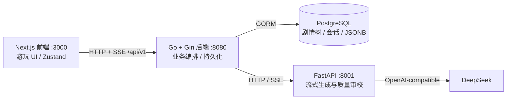

# Story Editor 开发交接手册

> **用途**：帮助新的开发者或 AI 在一次阅读后理解“现在能做什么、代码在哪里、哪些约束不能破、下一步该做什么”。
> **状态快照日期**：2026 年 7 月 28 日。若本手册与运行代码冲突，优先以代码和测试为准，并在修正后同步本手册。

## 1. 一句话定位与当前边界

Story Editor 的长期愿景是“AI 驱动的互动剧情共创社区”：用户既可以游玩，也可以创作、分享和再创作。

**已打通游玩 + 创作两条闭环**。游玩：登录 → 作品 → 会话 → AI 生成 → 状态变化/剧情树 → 回溯与读档。创作(MVP)：一句话灵感 →(Go 转发)agent `/assist/world` → 结构化表单微调 → `/assist/opening` → 存草稿/发布 → 首页作为可玩作品出现。社区未实现、路由未注册。

不要把 [prd.md](prd.md) 的愿景功能当作已实现功能。当前实现状态应以本手册、`CLAUDE.md` 和代码为准。

## 2. 当前完成度

| 域 | 已完成 | 未完成或限制 |
|---|---|---|
| 用户 | 后端注册/登录/JWT/资料、凭证分表；**前端登录接入完成**（游玩需登录，匿名与会话迁移已移除，见 §9.2）；**个人主页 `/me`（资料 + 编辑昵称/简介/头像 + BYOK 连接管理）**；**BYOK 已接入生成**（连接=账号级、模型=作品级，见 §12）；**注册赠 1 元平台额度 + 按 token 计费扣减**；头像上传 | OAuth/密码找回未做；**充值服务未做**（额度用尽只能自带 key）；单价需 admin 手填；旧 `User.LLMKeyCipher`（单 key）已废弃、列留孤儿 |
| 作品 | Story CRUD（列表/详情 LEFT JOIN users 带出 `creator_name` 作者昵称，只读投影）、作品列表、世界观/初始状态 JSON；**创作编辑器(MVP)**：`world_config`/`opening_content` 可写入、运行时校验(`pkg.ValidateWorldConfig`，草稿宽松/发布严格)、发布态切换、我的作品列表、assist Go 转发；**封面上传（`/uploads/image` + `cover_url`，见 §14）** | `/assist/polish`·`/assist/branches` 编辑内接入未做 |
| 游玩 | 开局、续写、自由输入、回溯、读档、删档、剧情树、状态合并；质量审校可开关（默认关）；**全组需登录，草稿仅作者可玩**；**hidden/未揭示 reveal 的数值不外发**（§9.2） | **匿名不能玩**（额度挂账号，详情页拦截并引导登录）；真实环境下的多回合质量/延迟指标尚未沉淀 |
| Agent | **流式生成(SSE)**、属性类型规整（含 hidden）、故事大纲导演、滚动摘要、审校分级 + 有记忆修订 + 超限降级交付 | RAG、多 Agent fan-out、独立 director/recall/write 子图未做 |
| 前端 | **双态设计体系（`docs/design` 落地，见 §13）**：管理态（白底 Inter + 全局 `AppHeader`）发现书库(错落瀑布 + 题材/搜索前端过滤 + 三态)、我的创作、社区占位、登录页(`/login` 双栏)、个人主页、admin、创作编辑器；阅读态（暖深色 Noto Serif + `useReadingTheme` 整页换肤 + 遮罩浓度/昼夜可调）作品详情、游玩(三栏舞台 + 状态轨 + 选项坞 1/2/3 快捷键 + 星图抽屉)。正文逐字流式(无首字下沉)、属性揭示门控可见性(hidden 全程不露面)、进度条按 `max` 声明画、登录/会话迁移、按作品配模型、作品级 8 主题换肤 | 社区功能、移动端细节/自动化测试未做 |
| 社区 | 无 | 路由**未注册**（访问 404）；浏览、详情、点赞、评论、搜索、排行榜均未实现 |
| 商业化 | SQL 蓝本中有概念 | 付费、打赏、分成、成就未做 |

### 2.1 实现矩阵：一个领域在四个地方各是什么状态

PRD 写愿景、`infa/sql` 写蓝图、GORM 建真表、API/UI 才是玩家摸得到的东西——四者进度不同步是本项目最容易踩的坑（比如 `community.sql` 表设计齐全，但一张表都没建、路由也没注册）。这张表就是为了让「某个东西到底做了没有」一眼可查。

| 领域 | PRD 目标 | SQL 蓝图 | GORM 运行模型（`main.go` AutoMigrate） | API / UI | 权威细节 |
|---|---|---|---|---|---|
| 用户与凭证 | §4 角色体系 | `users.sql` ✅ 同步 | `User`、`UserCredential` | 注册/登录/JWT/资料/头像 ✅ | §12 |
| 作品 | §1.1 创作 | `stories.sql` ✅ 同步 | `Story` | CRUD + 编辑器 + 发布严格校验 ✅ | §2 |
| 剧情树 | §1.1 游玩 | `play.sql` ✅ 同步 | `StoryNode` | **只由游玩链路写**；创作侧节点 CRUD 已下线（§9.2） | §5.1 |
| 游玩会话 | §1.1 游玩 | `play.sql` ✅ 同步 | `PlaySession` | 全链路 ✅，需登录 | §6 |
| BYOK 连接 | —（工程需求） | `llm.sql` ✅ | `LLMConnection` | `/llm/connections` ✅ | §12 |
| 作品级模型绑定 | — | `llm.sql` ✅ | `UserStoryLLMConfig` | `/llm/story-config/:storyId` ✅ | §12 |
| 平台模型设置 | — | `llm.sql` ✅ | `PlatformLLMSetting` | `/admin/llm/platform` ✅（需 admin） | §12 |
| 用量与额度 | §1.4 商业化 | `llm.sql` + `users.credit_micro_cny` ✅ | `LLMUsageLog` + `User.CreditMicroCNY` | 按 token 计费扣减 ✅；**充值未做** | §12 |
| 上传素材 | §1.1 | **无表**（文件落磁盘） | 无 | `/uploads/image` ✅；孤儿文件无回收（§9.2） | §14 |
| 社区（点赞/评论/收藏/关注） | §1.2 | `community.sql` **仅蓝图** | **无** | **路由未注册**，访问 404 | §9.2 |
| 付费 / 打赏 / 成就 | §1.4 | 仅 `stories.price_config` 字段 | 无 | 无 | `prd.md` §1.4 |

**运行中的模型就是这 9 个**：`User`、`UserCredential`、`Story`、`StoryNode`、`PlaySession`、`LLMConnection`、`PlatformLLMSetting`、`UserStoryLLMConfig`、`LLMUsageLog`。`infa/sql/` 里其余表（community 全部、素材/关注等）**没有任何一张进入运行库**——该目录不参与建表，见其文件头声明。

## 3. 系统架构与职责



### 3.1 三个进程的硬边界

- **`frontend/`**：只调用 Go 后端的 `/api/v1`，不持有数据库或 DeepSeek 凭证。
- **`backend/`**：唯一的业务编排与持久化入口。负责鉴权、作品/节点/会话、状态合并、Agent HTTP 调用。
- **`agent/`**：无数据库依赖。输入世界观、历史、状态和选择，输出结构化剧情 JSON。审校超限降级交付（不硬失败），仅 LLM 非法 JSON/网络异常才报错。

### 3.2 后端分层约定

```text
handler → service → repository
```

各层职责、模块边界（模块化单体：禁止跨模块直接依赖对方 repository，跨模块只读走 `service/ports.go` 的窄接口）、RBAC 与归属校验的完整规则都在 [`../CLAUDE.md`](../CLAUDE.md)，这里不再复述。**新增代码不得绕过这条依赖方向。**

## 4. 代码地图：从需求找到实现

| 想改什么 | 优先阅读的文件 |
|---|---|
| 后端启动、路由、依赖注入、迁移 | `backend/main.go` |
| 环境变量、DSN、Agent 地址 | `backend/config/config.go`、`backend/.env.example` |
| 游玩业务主流程 | `backend/internal/service/play.go` |
| Agent HTTP 契约 | `backend/internal/service/agent_client.go` |
| 剧情节点、会话、故事模型 | `backend/internal/model/node.go`、`play_session.go`、`story.go` |
| 所有游玩 API 入口 | `backend/internal/handler/play.go` |
| Agent 图和上下文拼接 | `agent/app/graph/story_graph.py` |
| Agent 生成/审校提示词 | `agent/app/prompts.py` |
| Agent 请求响应模型 | `agent/app/schemas.py` |
| Agent 配置 | `agent/app/config.py`、`agent/.env.example` |
| Agent 路由和错误语义 | `agent/app/routers/generate.py`、`assist.py` |
| 前端页面和游玩状态机 | `frontend/app/`、`frontend/store/playStore.ts` |
| 前端 API 信封与类型 | `frontend/lib/api.ts`、`frontend/lib/types.ts`、`frontend/lib/state.ts` |
| 完整设计的 SQL 蓝本 | `infa/sql/users.sql`、`stories.sql`、`play.sql`、`community.sql` |

## 5. 数据模型与不可破坏的约定

### 5.1 当前持久化模型

| 模型 | 关键字段 / 作用 |
|---|---|
| `User` / `UserCredential` | 用户资料与密码/OAuth 凭证分离；密码不出响应 |
| `Story` | 作品元信息；`world_config`（含 `background`/`style`/`rules`/`outline`(故事大纲，导演走向锚点)/`characters`/`initial_state`/`attributes`/`theme`(作品级主题皮肤 id，见 §13)/`recommended_models`）、`opening_content`、`price_config` 为 JSON/文本配置 |
| `StoryNode` | 邻接表剧情树。`parent_id`、`depth`、`choice_text`、`content`、`suggested_options`、`state_delta`、`state_snapshot`、`revealed_snapshot`(截至本节点已揭示的门控属性,供回溯恢复可见性)、`summary` |
| `PlaySession` | 会话归属与当前指针；`current_node_id`、`current_state`、`revealed_attrs`(本会话已揭示的门控属性键集)、`node_count`、`status` |

上表只列游玩链路的四个核心模型；**运行中共 9 个**，与 SQL 蓝图、API 的对应关系见 §2.1 实现矩阵。

### 5.2 状态规则

- `play_sessions.current_state`：会话**当前完整状态的唯一事实来源**。
- `story_nodes.state_delta`：本节点相对父节点的变化，仅用于解释和重建。
- `story_nodes.state_snapshot`：截至本节点的完整快照，服务于回溯/展示。
- `story_nodes.summary`：截至本节点的滚动前情提要，服务于后续续写，不是玩家状态。
- `play_sessions.revealed_attrs` / `story_nodes.revealed_snapshot`：本会话/截至本节点已向玩家揭示的「揭示门控」属性键集，服务于属性可见性（见 §5.3）；与 `current_state`/`state_snapshot` 同步更新、回溯一并恢复。
- 回溯只移动会话当前节点与状态（含可见性）；既有节点和分支绝不删除。

### 5.3 属性类型

`world_config.attributes` 可声明属性类型；Agent 与 Go 必须使用相同语义：

| 类型 | `state_delta` 形态 | 合并含义 |
|---|---|---|
| `number` | `{"hp": -10}` | 累加 |
| `scalar` | `{"location": "王城"}` | 覆盖 |
| `set` | `{"items": {"add": ["钥匙"], "remove": ["火把"]}}` | 集合增删 |

未声明类型的老数据由 Go 侧兼容推断；不要在 Agent 或前端各自发明不同的合并规则。

**隐藏属性 `"hidden": true`**：标了 hidden 的属性是"仅供 AI 参考的幕后仪表"（怀疑度/警戒度等）。它照常进 `current_state`、随 delta 合并、透传给 agent；差别在展示与提示：
- 玩家端：`AttrBar` 过滤不显示（前端另发 `GET /stories/:id` 取 `world_config` 解析 hidden 键）；
- Agent：`prepare` 的 `_hidden_attrs` 把隐藏键注入提示词，令 LLM 照常更新 delta、但不得在 content/options 点名或报数，只用剧情间接体现；
- 创作：`WORLD_SYSTEM` 允许 AI 生成世界观时主动把压力型属性标 hidden。
- 是未来"玩家自选隐藏属性"的地基。

**揭示门控属性 `"reveal": true`**（区别于 hidden 的"永不显示"）：标了 reveal 的属性玩家**发现前不显示、发现后显示**，由 AI 动态揭示。链路：
- 数据：per-session `play_sessions.revealed_attrs` + per-node `story_nodes.revealed_snapshot`（回溯恢复可见性）。属性值仍照常在 `current_state` 里被 AI 幕后追踪。
- Agent：`prepare` 的 `_write_reveal_gated` 把"尚未揭示的门控属性"注入提示，令 AI 在剧情真正让玩家发现/清点时，把该键放进输出的 `revealed` 列表；`normalize` 按声明白名单校验 `revealed`。
- Backend：`applyContinueResult`/`StartOpeningStream` 把 `revealed` 并入会话集与节点快照；`Backtrack` 从节点快照恢复。
- 前端：`AttrBar` 可见性 = 非 hidden ∧（非门控 ∨ 已揭示）；`playStore` 从 `world_config` 解析门控键、从 `session.revealed_attrs` 取已揭示键。
- 典型用途：解决"开局就显示 initial_state 全部属性"的违和（如《最后的深夜电台》"物资"标 reveal，整理物资前不显示，避免"整理却从5变4"的矛盾——见 §9.2）。

## 6. 最重要的运行流程

### 6.1 开局与续写

开局与续写**都走流式**。关键：`StartSession` 只建**空会话**（无根节点、`current_node_id=null`、`node_count=0`），开局正文改由游玩页触发流式生成——这样开局也能逐字流到浏览器（生成发生在游玩页，而非建会话时）。建空会话由**作品详情页**（`/story/:id`）的「开始新游戏」触发。

```text
前端（作品详情页）POST /play/sessions          （只建空会话，立即返回，current_node=null）
  → PlayService.StartSession → 建 PlaySession（无根节点）

前端进入游玩页 GET /play/sessions/:id → 发现 current_node=null →
前端 POST /play/sessions/:id/opening/stream   （流式开局，SSE）
  → PlayService.StartOpeningStream（幂等：根节点已存在则直接 done 返回）
  → 无 opening_content：Go 调 Agent POST /generate/stream 真逐字流式
    有 opening_content：正文作单帧 delta + POST /opening/complete 补选项/summary
  → 流结束建根 StoryNode + 回填 current_node_id/node_count=1
  → done 帧携带持久化后的 SessionResult

前端 POST /play/sessions/:id/choice/stream     （流式续写，SSE；旧的非流式 /choice 仍在）
  → PlayService.MakeChoiceStream
  → loadChoiceContext：回溯出 history（带 summary）
  → Go 调 Agent POST /continue/stream，SSE 逐帧转发给前端：
       delta（正文增量）/ revise（审校拒绝，前端清空重来）
  → 流结束拿到完整 AIResult 后 applyContinueResult：
       合并 state_delta → 同层语义合并去重 → 未命中才新建 StoryNode → 更新会话
  → done 帧携带持久化后的 SessionResult
```

流式与审校共存（真流式·单次哨兵分隔）：Agent `generate` 单次输出「正文 `<<<META>>>` JSON尾」，正文逐字流出，结束后解析尾部；尾缺失/非法用 structurer 兜底；再跑 review，拒绝则发 revise 并带反馈重来（上限同 `AI_REVIEW_MAX_RETRIES`）。落库/去重/合并只能在流结束后做（依赖完整 delta/options）。前端游玩页 `load()` 见 `current_node=null` 即触发 `startOpening()`，有按 sessionId 的去重守卫防严格模式双触发。

### 6.2 Agent 质量闭环

```text
prepare
  → generate（剧情、选项、state_delta、summary）
  → review（低温 AI 审查，分级：只挡阻断级硬伤）
       ├─ passed=true       → normalize → 返回
       ├─ passed=false 未超限 → 有记忆写手在上一稿上修订（writer_msgs 追加上一稿+反馈）
       └─ 超限            → deliver_degraded → normalize（降级交付最后一稿，degraded=1）
```

`AI_REVIEW_MAX_RETRIES` 默认是 `2`：最多初稿加两次重写。**超限不再硬失败**，而是**降级交付最后一稿**（`deliver_degraded` 节点）——理由：属性/`state_delta` 只是辅助 AI 分析与玩家参考的手段，轻微不精确可容忍，宁可交付略有瑕疵也绝不让玩家操作失败。仅 LLM 非法 JSON（重试耗尽）或网络异常才是真失败、转 HTTP 502。

审校采**分级**：只拦**阻断级硬伤**——正文与设定/前情/选择直接矛盾、正文无实质推进、非结局无选项或选项雷同、`summary` 篡改关键不可逆事实、JSON 结构坏；而 `state_delta` 数值精度、未遂动作是否记账等模糊情形一律放行（`STORY_SYSTEM` 已加"未遂动作不记账"规则消歧）。

### 6.3 长程记忆

续写优先注入：**最近一条非空 `summary` + 最近两段原文 + 当前状态/选择**。这让上下文长度与剧情深度近似无关；老会话无摘要时回退为“开局 + 最近窗口”的滑动窗口。详细方案见 [context-strategy.md](context-strategy.md)。

## 7. 对外接口地图

所有 Go API 的根路径为 `/api/v1`，响应信封统一为：

```json
{"success": true, "data": {}, "error": null, "meta": null}
```

### 7.1 Go 后端

| 域 | 接口 |
|---|---|
| 鉴权 | `POST /auth/register`、`POST /auth/login`、`GET/PUT /auth/profile`（登录签发的 JWT 现携带 `role` 快照） |
| 作品 | `POST/GET /stories`、`GET/PUT/DELETE /stories/:id`（`GET` 挂 `AuthOptional`：作者可读自己的草稿，其他人只读 published、越权返 **404 不返 403**；非作者拿到脱敏 `world_config`）。**节点 CRUD 已整组下线**，见 §9.2 |
| 游玩（全组 AuthRequired） | `POST /play/sessions`（建空会话）、`POST /play/sessions/:id/opening/stream`（SSE 流式开局，幂等）、`GET /play/sessions`、`GET/DELETE /play/sessions/:id`、`POST /play/sessions/:id/choice/stream`（SSE 流式续写）、`POST /play/sessions/:id/backtrack`（**所有按 sessionID 访问的接口均校验 `session.PlayerID` 归属**） |
| 图片上传（AuthRequired） | `POST /uploads/image`（multipart：`file` + `kind`∈{avatar,cover}，返回 `{url}`）；静态直出 `GET /uploads/*`（见 §14） |
| 创作辅助 | `POST /assist/world`、`/opening`、`/polish`、`/branches`（AuthRequired；Go 转发 agent；请求可带 `connection_id` 覆盖 world 环节连接） |
| BYOK（AuthRequired） | `GET/POST /llm/connections`、`PUT/DELETE /llm/connections/:id`、`POST /llm/connections/test`、`GET /llm/connections/:id/models`（拉端点模型列表）、`GET/PUT /llm/story-config/:storyId`（玩家在某作品的模型配置） |
| 平台设置（AuthRequired + `RequirePermission(authz.PermPlatformLLMManage)`，`RequireAdmin` 为其别名） | `GET/PUT /admin/llm/platform`、`POST /admin/llm/platform/test` |
| 社区（未实现） | 路由**未注册**，一律 404。空壳曾返 `success:true`，调用方会误判点赞/评论成功 |

游玩全组 `AuthRequired`，匿名游玩与 `POST /play/sessions/migrate` 已一并移除（原因见 §9.2）。前端 `api.ts` 每请求带 `Authorization: Bearer`（token 存 localStorage）。

### 7.2 Agent 服务

| 接口 | 作用 |
|---|---|
| `POST /generate/stream` `POST /continue/stream` | 流式生成：SSE `delta`/`revise`/`done`/`error` 帧（`done` 携带完整 AIResult） |
| `POST /opening/complete` | 为已写定的开场正文补起始选项 + summary（预设 opening_content 的作品） |
| `POST /merge-check` | 在 Go 的 `state_delta` 硬过滤之后判断同层候选是否语义等价 |
| `POST /assist/world`、`/opening`、`/polish`、`/branches` | 创作辅助；**经 Go `/api/v1/assist/*` 转发**给创作编辑器消费（agent 无鉴权/CORS，前端不直连；Go 侧用 180s `assistClient`） |
| `POST /assist/validate-key` | 校验某 LLM key 是否可用（一次性 ping，**独立于 `_build_llm` 缓存与生成管线**，不落库）；经 Go 的 `/llm/connections/test`、`/admin/llm/platform/test` 复用 |
| `GET /health` | 检查模型配置状态 |

**BYOK（LLMConfig 下发）**：`/generate/stream`、`/continue/stream`、`/opening/complete` 及 `/assist/*` 请求体可携带 `llm_write`/`llm_review`（play）或 `llm`（assist 单次），字段 `{provider,base_url,api_key,model}`。Go 侧按环节解密解析后下发；agent 用它构造**临时** `ChatOpenAI`（`_build_ephemeral`，不进全局缓存），缺字段/未下发时回退 `.env` 默认。写手用 `llm_write`、审校用 `llm_review`。**agent 不碰数据库**，所有 key/策略在 Go。

Agent 的开场和续写响应统一包含：`content`、`options`、`state_delta`、`summary`、`is_ending`、`ending_type`。详见 [`../agent/README.md`](../agent/README.md)。

## 8. 本地运行、测试与真实验收

### 8.1 配置

| 进程 | 示例文件 | 必要项 |
|---|---|---|
| Agent | `agent/.env.example` | **无必填项**：agent 不持有任何 LLM 凭据，key/端点/模型由 Go 随请求下发 |
| 后端 | `backend/.env.example` | 可达 PostgreSQL、`DB_*`、`JWT_SECRET`、`AGENT_URL`；可选 `UPLOAD_DIR`(默认 `./uploads`)、`UPLOAD_MAX_MB`(默认 5) |
| 前端 | `frontend/.env.local.example` | 可选 `NEXT_PUBLIC_API_BASE` |

推荐执行 `./scripts/dev.ps1`。注意后端必须以 `backend/` 为工作目录运行：模板路径和配置搜索路径依赖该目录。

### 8.2 已有自动验证

```powershell
cd backend
go test ./...

cd ..\agent
.\.venv\Scripts\python.exe -m compileall -q app tests
.\.venv\Scripts\python.exe -m unittest discover -s tests -v
```

当前 Python 测试覆盖“流式哨兵解析/结构化兜底/拒绝→有记忆修订/超限降级交付”（`test_stream.py`）、“parse 重试恢复/耗尽”（`test_llm_parse_retry.py`）与“揭示门控白名单/prepare 注入抑制”（`test_reveal.py`）。Go 有 `play_merge_test.go`（节点语义合并）与 `seed_config_test.go`（六部作品 world_config 逻辑一致性：键对应/类型匹配/initial/布尔标记）。

### 8.3 必做的人工验收

自动测试不能证明叙事好玩。每次修改 Agent 提示、上下文、质量规则或状态合并后，至少要：

1. 运行真实 Agent、后端和前端；
2. 连续游玩多回合，**专挑矛盾/高风险选项**，并回溯后开新分支、走深剧情；
3. 检查属性显示、状态变化、节点树、读档是否一致；
4. 检查摘要是否遗漏/篡改伏笔和人物关系；
5. 记录审校重写次数与耗时，避免质量循环把体验拖垮；
6. **验揭示门控**：开局属性栏不显示 `reveal` 属性（如《最后的深夜电台》物资/幸存者信任）→ 剧情"清点/首次接触"时才出现且数值合理（不再 5→4）→ **回溯到揭示前又消失**。

### 8.4 真机验收操作手册（起进程 + 留埋点 + 分析）

真人多回合验收的门槛很低。要**留存质量埋点**，关键是让 Agent 的 `story.metrics` 输出落到文件（`dev.ps1` 各开一窗、日志留不下来，故 Agent 单独起并重定向）：

```powershell
# 窗口A · Agent（*> 收下 stderr 上的 story.metrics 埋点到 agent.log）
cd agent
.\.venv\Scripts\python.exe -m uvicorn app.main:app --port 8001 *> agent.log

# 窗口B · 后端
cd backend; go run .

# 窗口C · 前端
cd frontend; npm.cmd run dev        # http://localhost:3000（PowerShell 下用 .cmd，裸 npm 受执行策略限制）
```

玩够量后**离线聚合埋点**：

```powershell
cd agent
.\.venv\Scripts\python.exe tools\aggregate_log.py agent.log
```

输出：首稿通过率 / 降级率 / 审校拒绝率 / **拒因按频次分布** / 完整延迟与 ttfb 的均值·p95 / 按 mode(start,continue) 分解。据此回答"叙事质量与延迟"这类可量化问题（指标含义见 §9.1）。

- **埋点两行**：`gen`（`outcome/elapsed_ms/ttfb_ms/review_failures/first_draft_pass/degraded/is_ending`）与 `review`（`verdict/attempt/issues`），源在 `agent/app/graph/story_graph.py`。
- **别用 `tools/sample_metrics.py` 做验收**：它自动线性采样（永远点第一个选项），触发不了三类高频拒因，只能跑通/看延迟基线（原委见 §9.2）。
- 日志覆盖不了、仍须人眼看的：摘要漂移、人物/伏笔矛盾、选择无后果、揭示/回溯一致性、阅读手感与延迟忍受度（即 §8.3 第 2/4/6 项）。

## 9. 当前风险、技术债与优先级

### 9.1 最高优先级：先量化游玩留存体验

下一位开发者不要直接上社区或支付，应先跑真实多回合样本并记录指标。

**已就绪的埋点**（`agent/app/graph/story_graph.py`）：

- **每次生成流一行 `gen`**（`_invoke_with_metrics`）：`mode`、`outcome`、`elapsed_ms`(完整回复耗时)、成功时附 `review_failures`(交付前被拒次数，0=首稿通过)/`first_draft_pass`/**`degraded`(是否超限降级交付)**/`is_ending`，失败时附 `err_type`/`detail`。`outcome`：`ok`(含降级交付) / `parse_error`(LLM 非法 JSON，`LLMParseError`) / `error`(其它)。审校超限**不再是失败**（不再有 `review_exhausted`）——它以 `outcome=ok degraded=1` 交付，另有一条 `review degraded ...` WARNING 记录被拒次数与理由。
- **每次审校判定一行 `review`**（`review` 节点）：`verdict`(pass/reject)、`attempt`、拒绝时附 `issues`。用来回答「审校到底在拒什么、是不是形同橡皮图章」，这是 `gen` 行的通过率无法单独回答的。

刻意不建管理端大屏/指标表——验证期用日志聚合即可。两个工具分工：

- `agent/tools/sample_metrics.py`：**自动线性采样**，进程内直驱 `run_start/run_continue` 现造数据（会调 DeepSeek）。只能刷漂亮数字、**触发不了三大拒因**（见 §9.2），对提示词质量改动无区分力，仅用于跑通/延迟基线。
- `agent/tools/aggregate_log.py`：**零依赖离线聚合器**，只读**真人真实游玩**产生的 agent 日志，不碰 app/DB/LLM。这才是给提示词质量“结账”的正道——真人的矛盾选择/回溯/深剧情才会让三大拒因真正发作。用法：真人游玩时把 agent 进程输出重定向到文件（`uvicorn app.main:app --port 8001 > agent.log 2>&1`），玩够量后 `./.venv/Scripts/python.exe tools/aggregate_log.py agent.log`，直接出报表（首稿通过率/降级率/审校拒绝率/**拒因按频次分布**/延迟与 ttfb p95/按 mode 分解）。

等社区上线、指标从"验证一次"变成"每天要看"且鉴权就绪后再考虑大屏。

由此可直接算出：

- 首稿审校通过率(`first_draft_pass=True` 占比)、每局平均重写次数(`review_failures` 均值)、审校拒绝率(`review` 行 reject 占比)；
- 完整回复延迟与 p95(`elapsed_ms`)；流式续写另打 `stream=1` 与 **`ttfb_ms`（首字延迟）**——实测约 1.5s（vs 完整 ~7.7s）。注意 `app/main.py` 已给 `story.metrics` 挂 handler，否则 uvicorn 默认吞掉 INFO 埋点；
- 降级交付占比(`degraded=True` 占比，反映审校拖到超限的频率)；真报错率按 `parse_error` / `error` 细分。

仍需人工观察、日志无法覆盖的：

- 摘要漂移、人物/伏笔矛盾、选择无后果等案例；
- 回溯后分支的状态与叙事一致性。

### 9.2 已知技术债

**质量审校（review）**
- review 是同一模型的二次调用：能抬下限，不保证事实正确，且加延迟与费用。真实样本拒绝率约 18%，**不是橡皮图章**。两类主要拒因：`state_delta` 与正文不一致、`summary` 漏记新增实体。（第三类「选项 hint 无后果」已随 hint 移除而作废。）
- 已针对拒因把 `prompts.py` 的散文规则换成**可自检的动作锚点**（写 JSON 尾前回看正文倒推 delta/summary；落笔前自检本段新登场人物/物品/线索），而不是堆更多规则。
- ⚠️ **这类提示词改动离线测不出来，别再试。** 线性采样（`agent/tools/sample_metrics.py`）、逆境 A/B（`agent/tools/adversarial_ab.py`，新旧提示词喂完全相同的玩家输入）、直接审计转录，三种手段都跑出「新旧完全一致」——因为逆境压的是剧情黑暗度，而拒因是**输出纪律**问题（长上下文摘要漂移、真正模棱两可的状态变化、模型方差），选择文本逼不出来。**唯一能结账的是真人多回合埋点**（`gen`/`review` logfmt 已就位，见 §9.1），攒到几百回合再统计 `first_draft_pass`/`reject_rate`/拒因分布。两个工具留库供换模型时复用。
- 想要更灵敏的离线仪表，得换成对 delta 完整性/实体召回打分的**分级 LLM 裁判**，而非 review 的二元闸门——pre-launch 不值当。
- **选项 hint 已整体移除**：真机试玩发现「收益+转折+风险」两面结构太标准化，且每次提前剧透后果、破坏悬念。属性变化预估也被否（反事实预测常与真实 delta 不符、更游戏化、隐藏属性还不能显示）。选项回归**纯行动文字**，代价交给玩家在剧情里承受；`normalize` 主动剥离 hint 兜底。
- 待查：采样时 openai SDK 层几乎每次调用都有一次 `Retrying request`，疑似 DeepSeek 限流，可能抬高了 `elapsed_ms`。

**其余**
- LLM 偶发返回非法 JSON（真实样本约 7%）。`chat_json` 对 `LLMParseError` 附纠正指令重试 `AI_PARSE_MAX_RETRIES`（默认 1）次并打 `parse_retry` 点；耗尽仍抛。
- `summary` 是有损压缩，长剧情仍会漂移；RAG 是后续补精确细节的方案。
- **匿名 guest 共享 PlayerID 已彻底移除（2026-08-11）**：曾经所有匿名玩家共用同一个 seed `guest` id，`checkSessionOwner` 因此对匿名会话之间完全失效（彼此可读可删）。现 `/play` 全组 `AuthRequired`，`player()` 的 guest 回退、`/play/sessions/migrate`、`MigrateGuestSessions` 一并删除。**取舍**：历史 guest 存档留在库里但不可达、不提供迁移——这是为消除已确认越权面所付的明确代价。seed `guest` 仅剩「演示作品作者」一个身份。
- **创作侧 node CRUD 已整组下线（2026-08-11）**：`POST /stories/:id/nodes`、`GET /nodes/:id/children`、`PUT/DELETE /nodes/:id` 连同 `NodeHandler`/`NodeService` 一起删除。原因是它以 `sessionID=uuid.Nil` 写非空列、且创建路径不校验作者，只摘一半会留下「作者去改玩家会话节点」这种更怪的语义。`StoryNode` 模型与 repository 保留，专供游玩链路。将来要做可视化作者树，必须新建 `DraftNode` 或明确可空 session 的模型，不能复用游玩节点。
- **上传孤儿文件无回收（2026-08-10）**：上传成功但表单没保存、换头像/封面后的旧文件，都会永远留在磁盘。最小治理方案是「上传即写一行 assets 表 + 夜间扫描无引用记录」，0 用户阶段不值得。
- **上传走单机本地磁盘（2026-08-10）**：`UPLOAD_DIR` 是进程本地目录，多实例必须挂共享卷（compose 已挂 named volume `uploads`）。换对象存储只需替换 `service.UploadService`，`url` 语义不变、无需迁移表。
- **平台额度的单价要 admin 手工维护（2026-08-10）**：`platform_llm_settings.price_*` 默认 0，**不填就永远扣不动额度**（安全的失败方向，但等于无限免费）。模型涨价也不会自动跟。
- **事后扣费允许最后一回合透支（2026-08-10）**：花多少 token 只有调用完才知道，因此扣到 0 为止、不预扣。真要精确就得先估上限再冻结，0 用户阶段不值当。
- **匿名玩家无法游玩（2026-08-10，产品取舍不是 bug）**：额度挂账号、平台档对匿名不给，所以未登录只能浏览，点进详情页会被拦并引导登录（「登录即赠 1 元」）。2026-08-11 起后端也不再接受匿名游玩请求，前后端一致。
- **草稿只有作者可读可玩（2026-08-11）**：`service.canViewStory`/`canPlay`（`internal/service/access.go`，纯函数、有单测）统一判定，非作者一律 404 不返 403（草稿的存在本身是作者的私事）。
- **作品下架后既有会话转只读（2026-08-11）**：作者取消发布，别人玩到一半的那一局**可以读完，但不能再推进**——这是「引用模式」的下架语义（PRD §5.4.8）。`PlayService.storyGate` 返回 `playable`，`GetSession` 据此置 `SessionResult.read_only`；写路径（续写 / 开场生成 / 回溯）一律被 `readOnlyErr` 拒绝，文案明确、不用 404：玩家早就玩过这部作品，藏它没有意义。**注意 SSE 路由的状态码仍是 200** —— `sseStart` 在调 service 前就提交了响应头，所以续写/开场是以 `event: error` 帧送出该文案（本项目所有流式错误都如此，前端读 `detail`）；只有 `backtrack` 这类普通 JSON 路由才真的返 403。读档列表的 `available=false` 是同一含义，卡片仍可点，状态照常脱敏后外发。
- **玩家可见数据投影已完成（2026-08-11）**：`hidden` 属性与未揭示的 `reveal` 属性，其数值不再出现在任何游玩接口的 `current_state`/`state_snapshot`/`state_delta` 里（`service/player_view.go` 的 `attrView`）。节点按**自身** `revealed_snapshot` 过滤，所以时间线不会提前剧透、回溯到发现之前会重新隐藏；会话按 `revealed_attrs`。作者玩自己的作品不脱敏。读档列表取不到作品时整份状态置空（宁可多挡）。
- 社区路由**未注册**（2026-08-11），访问一律 404。此前空壳 handler 返 `success:true`，会让调用方误判操作成功。
- `AutoMigrate` 适合当前 demo，不等同于生产级迁移治理。
- Go 侧的 context 透传、优雅关闭、seed 开关等工程化问题记在 [prd.md](prd.md) 开放问题里。

### 9.3 建议的后续顺序

1. **试玩与观测**：补 Agent/PlayService 回归测试、埋点或日志，跑真实多回合样本。
2. ~~**创作前端**：消费 `/assist/*`，打通"创作 → 游玩"~~ ✅ 已完成(MVP)：`/create`·`/edit/:id`·`/mine`，AI 优先 + 结构化属性表；后端补 `world_config` 输入/校验/发布态/assist 转发。剩余打磨：`/assist/polish`·`/assist/branches` 编辑内接入。
3. **Agent 阶段二**（**因备案冻结真机验证而暂缓**，待线上恢复后带真实数据做）：依据数据选择先拆 director、先补 recall/RAG；不要一次完成完整多 Agent。
4. **社区 MVP**：发布、浏览、详情、点赞/评论；随后才考虑付费与成就。

## 10. 文档维护规则

| 文档 | 应记录什么 | 何时更新 |
|---|---|---|
| `README.md` | 项目入口、架构、当前概览、快速启动 | 主链路/入口/优先级变化 |
| 本手册 | 现状、边界、文件入口、交接风险、验证方式 | 任一模块状态或契约变化 |
| `CLAUDE.md` | 开发规范、分层边界、实现约定、**不放进度状态** | 修改工程规则或运行方式 |
| 模块 README | 模块接口、配置、目录、测试 | 修改模块契约/流程/配置 |
| `docs/design.md` | 技术选择、演进和权衡 | 修改架构/数据/Agent 方案 |
| `docs/prd.md` | 产品愿景、范围、开放决策 | 修改产品目标或优先级 |
| `infa/sql/` | 完整数据模型设计 | 新增持久化模块或改变长期 schema |

**完成代码任务不等于完成交付。** 涉及当前行为、配置、接口、数据字段或优先级的改动，至少更新本手册和对应模块 README；必要时同步设计文档与 `CLAUDE.md`。

**怎么写**见 `CLAUDE.md` 的「Keep docs small」——一句话版本：改受影响的那几行，不要另起一节；一个事实只存一处，别处只放指针；git 是变更日志，文档不是。

## 11. 接手第一天检查清单

- [ ] 先阅读本手册、`CLAUDE.md` 和目标模块 README。
- [ ] 查看 `git status`，区分前人未提交改动与本次改动，不覆盖未知修改。
- [ ] 复制三份示例环境文件，确认 PostgreSQL 和 DeepSeek 配置。
- [ ] 跑 Go 测试与 Agent 离线测试。
- [ ] 用 `scripts/dev.ps1` 启动三进程，完成一次开局、续写、回溯、读档的人工冒烟。
- [ ] 开始新功能前，先确认它属于“当前游玩留存优先级”还是未来愿景，避免跳过关键验证。

## 12. BYOK 多供应商 / 分环节模型 / 平台设置 / admin 门槛

**目标**：支持任意 OpenAI 兼容 key；平台 key 入库由管理员管理；游玩优先烧**玩家自己**的 key，未配则从**注册赠送的 1 元额度**里按量扣平台 key，额度用尽必须自带连接。
**分层**：连接（key/base_url）是**用户级**（账号里管一次）；「用哪个模型」是**作品级**（每玩家在每作品各配各的）。作者的推荐模型只作标注、不自动套用（作者与玩家配置大概率不同，复刻也用不了）。

**数据模型**
- `llm_connections`（每用户多条）：`name / provider(标签) / base_url / api_key_cipher(AES-GCM) / default_model`。
- `user_story_llm_configs`（复合主键 user_id+story_id）：`bindings` TEXT/JSON = `{"write":{"conn":"<uuid>","model":""},"review":{...}}`；`model` 空→回退连接 `default_model`。仅 write/review。另有 `review_enabled BOOL`（**默认 false**，见下）。
- `platform_llm_settings`（全局，admin 管，每环节一行）：`stage PK / provider / base_url / api_key_cipher / model / price_in_per_mtok / price_out_per_mtok`。单价单位是**元 / 百万 token**（照抄供应商定价页）。⚠️ **单价为 0 则永远扣不动额度**，等于平台 key 无限免费——admin 页对此显式告警。
- `users.credit_micro_cny BIGINT DEFAULT 1000000`：平台额度余额，单位**微元**（1e-6 元）。整数避免浮点累加误差；列默认值 = 1 元，注册即到账（AutoMigrate 加列时 Postgres 也会给存量行补上）。
- `llm_usage_logs`：每笔**平台额度**消费的流水（user/story/stage/model/tokens/cost_micro/estimated）。玩家用自己的 key 不入账。没这张表，"我那 1 元花哪了"只能靠猜。
- 作者推荐模型：`stories.world_config.recommended_models = {"write":{"model":"..."},"review":{...}}`（前端编辑器写、作品详情页只读展示；后端透传，不参与解析）。
- 旧 `User.LLMKeyCipher`（单 key）**废弃**，列留孤儿（GORM 不删列，0 用户未迁移）。

**解析优先级**（`service.LLMResolver`，单测见 `llm_resolver_test.go`）：
- 游玩（`ResolveForPlay(userID, storyID, stage)`，stage∈{write,review}）：**作品级用户连接 → 平台档（需有额度）→ nil**。
- 创作（`ResolveForAssist(userID, overrideConnID)`）：**编辑器覆盖连接 → 平台 world（需有额度）→ nil**。
- 命中连接/平台时解密 key；连接失效/解密失败**跳到下一档**不硬报错。
- **返回 nil 就是硬失败**（`pkg.CodeNoLLMConfig` = 10016），调用方必须在发请求前报错。曾经的第三档「agent 自己 `.env` 的 `DEEPSEEK_API_KEY`」**已删除**——那是一层看不见、无法限额、也不归 admin 管的服务器成本。`TestPlatformNeedsCredit` 守着这条别被加回来。
- 平台档对**匿名一律不给**：额度挂账号，且所有匿名玩家共享同一个 seed guest id（§9.2），给了等于让第一个访客花光所有人的额度。

**额度与扣费**（`service/credit.go`）
- 只对 `AgentLLMConfig.Source == platform` 的环节扣（该字段 `json:"-"`，不下发给 agent——agent 不该知道钱的事）。
- agent 在 `done` 帧回传按环节分开的 token 用量；Go 按该环节单价折算成微元、**向上取整**（几百 token 的调用四舍五入会常年归零，1 元就成了无限），写一行流水并 `UPDATE ... GREATEST(0, credit - ?)`。扣减在 SQL 里做，避免并发回合先读后写吞掉一次消费。
- **事后扣费**：花多少 token 只有调用完才知道，事前无法预扣准确金额，因此**最后一回合可能略微透支**（扣到 0 为止）。用一套精确预扣换这点误差，0 用户阶段不值当。
- 扣费失败只记日志、不向上报错：token 已经烧掉了，此时让玩家的回合失败于事无补。
- `estimated=true` 表示端点没在响应里回 usage、token 数是**按字符估算**的（OpenAI 兼容端点对 `stream_options.include_usage` 支持不一）。这批为真时说明扣费全靠估算——是需要知道的事实，别被精确数字掩盖。

**review（质量审校）改为作品级开关，默认关**
- 关：不下发 `llm_review`，agent 整段跳过审校（省约一半 token），埋点打 `review=off`，不伪装成 `first_draft_pass=true`。
- 开：`review` 环节**必须**选一条连接，否则保存被拒（不静默降级成"关掉"——那会让玩家以为审校在生效）。
- 默认关的代价：质量下限低于以前（以前人人都过审校，真实拒绝率约 18%）。权衡写在前端开关旁。

**下发链路**：Go 解析出 `AgentLLMConfig{provider,base_url,api_key,model}` → 塞进 agent 请求体（`llm_write`/`llm_review`/`llm`）→ agent `_build_ephemeral` 构造临时 ChatOpenAI。**agent 不碰库、也不持有任何默认凭据**：三个关键字段缺一即抛 `LLMConfigMissing`。key/额度/策略全在 Go。

**admin 门槛（最小）**：JWT 携带 `role` 快照（`pkg.GenerateToken(userID, role, secret)`）；`middleware.RequireAdmin()` 校验；`/admin/llm/*` 挂 `AuthRequired+RequireAdmin`。
- **产生第一个 admin**：手动改库 `UPDATE users SET role='admin' WHERE username='<你的用户名>';`，然后该用户**重新登录**（role 是 JWT 签发时快照，旧 token 不含新角色）。前端 `/admin` 与 `/me` 的「平台设置」入口按 `user.role==='admin'` 显示；后端才是硬防线。

## 13. 双态设计体系 + 作品级主题换肤

**双态（`docs/design` 落地）**：`app/globals.css` 分三层——① token 层：管理态浅色在 `:root`（`--bg/#fff`、`--fg`、`--accent/#1677ff`、`--shadow-card` 等），阅读态暖深色在 `.od-reading` 作用域（`--ink/--scrim/--scrim-alpha(下限 .52)/--accent-read/--glow-a/-b/--scene-*`）；② 管理态组件层（`.app-header/.work-card/.wall/.chip/.btn/.card/.field/三态`）；③ 阅读态组件层（`.od-bg/.od-grain/.od-vignette/.scrim/.od-stage/.od-rail/.reader/.dock/.choice/.od-drawer` + 星图树阅读配色）。字体：`layout.tsx` 经 `next/font` 注入 Inter(`--font-sans-inter`) + Noto Serif SC(`--font-serif-noto`)，`globals.css` 的 `--font-sans/--font-serif` 引用它们并接系统回退栈。**两边变量名必须错开**——同名时 `:root` 与 next/font 注入的 class 权重相同(0,1,0)，后加载的 `globals.css` 会覆盖掉真实字体名，webfont 白下载不生效（已踩过一次）。

- **管理态**（默认）：发现书库、我的创作、社区、登录表单、个人主页、admin、创作编辑器。统一 `components/AppHeader.tsx`（sticky 毛玻璃 + 分支节点 glyph + 导航 + 搜索 + 创作 + 账户下拉 `AuthWidget`）。外壳恒中性，彩色只来自作品自身。
- **阅读态**：作品详情、游玩、登录左氛围栏。整页暖深 + 分层 CSS 场景背景 + 半透明遮罩；正文衬线**无首字下沉**（按既定偏好，偏离原型这一处）。游玩页遮罩浓度滑块（`--scrim-alpha`，夹在 52–92）与昼/夜（`data-mode`）**两者同构**：都存 localStorage、都由 `useReadingTheme` 在挂载时套用、卸载时清除（inline 的 `--scrim-alpha` 必须 `removeProperty`，否则漏到外壳页并与控件 state 失同步）。

**作品级主题（8 套）**：主题 id 存 `world_config.theme`（缺省 `star`），**零后端改动**透传（后端固定 struct 反序列化忽略未知键）。`lib/types.ts` `THEMES` = star/ink/horror/sci/love/xian/heal/radio，每套 `swatch=[强调色,渐变起,渐变止]`（`themeAccent/themeGradient/themeLabel` 取用）。**仅阅读态换肤**：`lib/useReadingTheme.ts` hook 把 `od-reading` class + `data-work-theme` + `data-mode` + `--scrim-alpha` 挂到 `<html>`（CSS 变量只父→子继承，故挂 html 非 .wrap），卸载全部清除回管理态白底。`globals.css` 的 `.od-reading[data-work-theme="…"]` 各覆盖 `--glow-a/-b/--accent-read/--scene-*`（star 默认无需块）。消费者：详情页 `app/story/[storyId]/page.tsx`（读 `parseWorld().theme`）、游玩页 `app/play/[sessionId]/page.tsx`（读 `playStore.theme`，`load()` 复用已拉 `/stories/:id`，零额外请求）。管理态页不挂 → 恒白底中性。

**入口/展示**：编辑器 `StoryEditor.tsx` 第 5 步「主题与生成」的色块选择器（读 `THEMES`），与封面上传并列；`editorStore.ts` `theme` round-trip。发现页封面卡 `StoryCard.tsx` 有封面图时用图 + 主题渐变半透明罩层，无图时用纯主题渐变（管理态外壳始终白），kicker/点缀用强调色。星图树/抽屉在阅读态自动取暖金配色。

**边界（不做）**：玩家全局覆盖皮肤推迟。（`--reader-bg` 自主背景图替换点已由作品封面接上，见 §14。）

### 13.1 沉淀下来的硬约束

原 13.1–13.6 是六段按日期堆的变更叙述（2026-08-10 的三个阶段）。**过程已在 git log 里**（`f167c29`、`a53097d`），这里只留改完之后仍然生效、且踩过坑才知道的约束。

**布局与卡片**
- 书库作品墙是**等大网格**（`grid` + `repeat(auto-fill, minmax(260px,1fr))`），不是 `column-count` 瀑布——多列是竖向填充，阅读顺序会变成「第 1 列从上到下再第 2 列」，且 6 张卡会排成左重右轻。
- 卡片等大靠：封面 `min-height: 210px` + 列向 flex，标题钳 2 行、摘要钳 3 行，CTA 用 `margin-top: auto` 顶到封面底部（标题长短不一时 CTA 仍在同一水平线）。**骨架卡必须同步等高**，否则加载态到落地会跳动。
- kicker 用 `tags[0]`（真题材），不是 `themeLabel()`——`theme` 只决定配色，拿它当题材会让《孤岛探案》标成「恐怖 · 怪谈」。首页 chip 从**实际在架作品**的 `tags[0]` 聚合并计数，少于两类整条不出。
- 窄屏（≤1080px）**不隐藏属性轨**：属性是「选哪一项」的依据，藏了就没法决策。左轨改成正文上方可横滑的状态带，右轨收起。

**组件**
- **新组件必须在同一阶段就有真实消费者**，只建不接等于新造死代码。
- `Dialog` 必须 **portal 到 `body`**：留在原组件树会被祖先的 transform/overflow 裁掉（`.scrim`、`.od-drawer` 都带 transform）。配套：焦点陷阱 + 焦点归还、Esc 关闭、滚动锁定。弹窗打开时错误提示要按开合分流，否则被遮罩挡住、用户只看到「保存」毫无反应。
- **轻量破坏性动作用行内二次确认，不弹窗**（删作品/删连接是点两下）。
- Toast 统一走 `useToast()`（统一时长、连续提示重新计时、卸载清 timer）。
- **`components/editor/PublishCheck.tsx` 镜像 `pkg/worldvalidate.go` 的 strict 分支** —— ⚠️ 改后端 strict 规则必须同步改它，否则前端放行、后端拒。
- 编辑器是**分步向导**（六步，同一时刻只渲染当前步），不是长表单：世界观那一段字段密集（标题/简介/背景/风格/题材/基调/规则/大纲/角色），和开场、属性表堆一页里作者不知道下一步干什么。完成态只由发布检查有检查项的步骤驱动——没有检查项的步骤不打勾，否则误导成「这步做完了」。
- **保留的「暂时没人用」样式**（有明确后续消费者，删了要重写）：`.chapter`/`.reader h1`（阅读态章节标题）。
- 氛围场景（`[data-scene]`）是**当下氛围、不持久化**，退出阅读态即清；昼夜与遮罩浓度才是长期偏好（localStorage + `PrefsBoot` 每次加载套回 `<html>`）。

**token 合规的复查口径**（改完实测过一轮，回归时照这四条量）
- 组件层硬编码色 ≤4（且全为永远深色的封面高光/文字投影这类装饰，已注释）；
- 每屏可见 accent ≤2（`.eyebrow::before` 默认中性，只有每屏第一条挂 `.lead` 才用 accent）；
- 无可访问名的输入 0；各路由 header/nav/main 各 1；
- 新增变量**先回写 `docs/design/tokens.css`** 再落 `globals.css`，不两边各写一份。

**数据与后端**
- `seed()` 有自愈：`healSeedDuplicates` 在 ensureStory 之前跑。guest 被删后重建会拿到**新 UUID**，旧的 6 部作品成孤儿并被整套重建一遍。自愈只处理**种子标题**且**无主或属于当前 guest**的行（真实用户同名作品绝不碰），同标题多行保留 `created_at` 最早的一份（它挂着玩家会话，删了会级联清进度），并把它认领给当前 guest。幂等，不需要手工清库。
- `StoryService.SetStatus` 发布前拦空标题（`ValidateWorldConfig` 只管 world_config，管不到标题）。若又出现空标题的已发布作品说明被绕过（如直接改库）：`SELECT id, creator_id FROM stories WHERE status='published' AND btrim(title)=''`，作者仍在则降草稿、已删号则删除。
- 作者署名走 `LEFT JOIN users` 投影 `creator_name`（`gorm:"->;-:migration"` 只读不建列），空则前端**整块不渲染**——统一挂个假作者名比不署名更伤。⚠️ **join 后 `users` 也有 `status`/`created_at`，`listWhere` 里所有列名必须带 `stories.` 前缀。**
- 注册的 username 由**后端**派生（`service.generateUsername`），不由前端 `email.split("@")[0]`——那会让 `a@x` 与 `a@y` 撞车，且报错对不上用户填过的任何一栏。邮箱唯一性**先查**。

## 14. 图片上传（头像 / 作品封面，2026-08-10）

**一句话**：一个通用上传端点产出 URL，绑定由各自已有的更新接口完成；文件落本地磁盘，静态直出。

**接口**
- `POST /api/v1/uploads/image`（AuthRequired，multipart）：字段 `file` + `kind`∈`{avatar, cover}`，返回 `{"url": "/api/v1/uploads/<kind>/<yyyy-mm>/<uuid><ext>"}`。
- `GET /api/v1/uploads/*`：Gin `api.Static` 直出。
- 绑定不走上传接口：头像随 `PUT /auth/profile` 的 `avatar_url` 存，封面随作品保存的 `cover_url` 存。**「上传成功」不等于「已保存」**，这是刻意的——上传没有副作用。

**为什么挂在 `/api/v1/uploads` 而不是裸 `/uploads`**：生产 nginx 只有 `/api/v1/ → 8080` 和 `/ → 3000` 两条 location，裸路径会被转给 Next.js。挂进 API 命名空间后反代规则天然覆盖，前端拼 `NEXT_PUBLIC_API_BASE` 在 dev（绝对地址）与 prod（同源）下都对。**但 nginx 仍需 `client_max_body_size 8m`**（默认 1m 会 413），已写进 `deploy/nginx/story-editor.conf`。

**校验口径（`pkg/upload.go` + `service/upload.go`）**
- 类型判定只看**文件头字节**（`http.DetectContentType`），不信 `Content-Type`、不信扩展名——把 `evil.exe` 改名 `a.png` 必须被挡（有测试）。
- 白名单 jpeg/png/webp/gif。**SVG 故意排除**：它是 XML 可内嵌脚本，而上传目录同源直出，放行等于开存储型 XSS。
- 大小上限 `UPLOAD_MAX_MB`（默认 5MB），用 `io.LimitReader(max+1)` 兜底而非信 `Content-Length`；超限**删除半成品**再报错（有测试）。
- 落盘文件名一律 uuid，不保留原始文件名；`kind` 白名单化（它决定一级目录，否则 `kind=../../etc` 就是路径穿越，有测试）。
- 业务错误码：`10014` 格式不支持、`10015` 超出大小限制。

**服务端不做图片处理**，缩放放在前端（`lib/imageResize.ts`，canvas 等比缩到最长边 avatar 512 / cover 1280，导出 webp q0.85；GIF 跳过以免丢动画；任何一步失败都回退原文件）。理由：省掉图像库依赖与一倍代码量，而手机大图的问题在客户端解决同样彻底。

**为什么不建 `story_assets` 表**：`infa/sql/stories.sql` 里那张表已设计好（oss_key/url/width/height/mime），但它 `story_id NOT NULL`，装不下用户头像；当前也只需要「一张图一个 URL」。本期只加 `users.avatar_url`，沿用已有 `stories.cover_url`。等真做立绘/BGM/素材库再建——届时 `url` 语义不变，不用迁移数据。

**前端接入**
- `lib/api.ts`：`api.upload(kind, file, name)` 是独立的 multipart 通道（**不设 `Content-Type`**，boundary 必须由浏览器带）；`assetUrl(u)` 把相对路径补上 dev 的后端源。
- `components/ImageUpload.tsx`：通用控件（`kind` 决定圆形/矩形预览），真 `<button>` 触发隐藏 file input，上传中/空/失败三态齐全。
- 消费点：`/me` 头像（保存时**手动双写 localStorage + `useAuthStore.setState`**，否则顶栏不刷新）、`AuthWidget`、`/mine` 资料头；封面在编辑器第 5 步「主题与生成」、`StoryCard`、`/mine` 作品卡、`SessionCard`、以及阅读态的 `--reader-bg`。
- **无图时的渲染与改动前完全一致**：所有位置都回落原来的主题渐变 / 昵称首字母，不引入「默认灰头像」这种无信息占位。
- **有图时仍叠一层主题渐变罩层**（`lib/types.ts` 的 `coverStyle`，用 `color-mix` 降透明度）：封面上压着白色标题/摘要/CTA，裸铺照片会让对比度跌破 4.5:1；罩层同时保住「彩色只来自作品主题色」这条铁律。有封面时不加 `.cover.alive`——那个 16s 漂移靠拉伸 `background-size`，用在照片上会变形。

**部署**：`UPLOAD_DIR` 默认 `./uploads`（相对 `backend/`，与 `LoadHTMLGlob("../templates/*")` 同一个 cwd 约束）；容器里用绝对路径 `/data/uploads` 并挂 named volume `uploads`（`deploy/docker/docker-compose.yml`），否则 `up --build` 一次图就全没了。`backend/uploads/` 已进 `.gitignore`。

**已知限制**：孤儿文件无回收、单机本地磁盘（见 §9.2）；作品卡的作者小头像 `.au` 仍是灰圆——`StoryResponse` 只带 `creator_name`，要显示作者头像需按 `CreatorName` 的 `->` + `-:migration` 只读投影再加一列，留待社区期。
