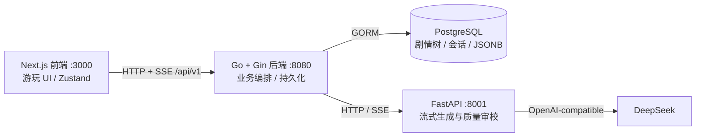

# Story Editor 开发交接手册

> **用途**：帮助新的开发者或 AI 在一次阅读后理解“现在能做什么、代码在哪里、哪些约束不能破、下一步该做什么”。
> **状态快照日期**：2026 年 7 月 28 日。若本手册与运行代码冲突，优先以代码和测试为准，并在修正后同步本手册。

## 1. 一句话定位与当前边界

Story Editor 的长期愿景是“AI 驱动的互动剧情共创社区”：用户既可以游玩，也可以创作、分享和再创作。

**已打通游玩 + 创作两条闭环**。游玩：作品 → 匿名会话 → AI 生成 → 状态变化/剧情树 → 回溯与读档。创作(MVP)：一句话灵感 →(Go 转发)agent `/assist/world` → 结构化表单微调 → `/assist/opening` → 存草稿/发布 → 首页作为可玩作品出现。社区路由仍是桩。

不要把 [prd.md](prd.md) 的愿景功能当作已实现功能。当前实现状态应以本手册、`CLAUDE.md` 和代码为准。

## 2. 当前完成度

| 域 | 已完成 | 未完成或限制 |
|---|---|---|
| 用户 | 后端注册/登录/JWT/资料、凭证分表；**前端登录接入完成**（可选登录，未登录仍匿名 guest；登录后迁移本浏览器 guest 会话到账号）；**个人主页 `/me`（资料 + 编辑昵称/简介 + BYOK 连接管理）**；**BYOK 已接入生成**（连接=账号级、模型=作品级，见 §12） | OAuth/密码找回未做；平台 key 额度限制未做；旧 `User.LLMKeyCipher`（单 key）已废弃、列留孤儿 |
| 作品 | Story CRUD、作品列表、世界观/初始状态 JSON；**创作编辑器(MVP)**：`world_config`/`opening_content` 可写入、运行时校验(`pkg.ValidateWorldConfig`，草稿宽松/发布严格)、发布态切换、我的作品列表、assist Go 转发 | 封面上传、`/assist/polish`·`/assist/branches` 编辑内接入未做 |
| 游玩 | 开局、续写、自由输入、回溯、读档、删档、剧情树、状态合并 | 真实环境下的多回合质量/延迟指标尚未沉淀 |
| Agent | **流式生成(SSE)**、属性类型规整（含 hidden）、故事大纲导演、滚动摘要、审校分级 + 有记忆修订 + 超限降级交付 | RAG、多 Agent fan-out、独立 director/recall/write 子图未做 |
| 前端 | 作品选择、**作品详情/过渡页**、游玩(顶栏剧本名 + **左侧状态台 + 正文居中 + 星图树右抽屉**布局)、历史会话、正文逐字流式、属性揭示门控可见性、**登录/注册 + 会话迁移**、**创作编辑器**(`/create`·`/edit/:id`·`/mine`，AI 优先 + 结构化属性表)、**个人主页 `/me`**(资料编辑 + BYOK 连接管理)、**作品详情页按作品配模型 + admin `/admin` 平台设置**、**作品级主题换肤**(创作者在编辑器选，玩家进详情/游玩页整页换肤，见 §13) | 社区、移动端/无障碍/自动化测试未做 |
| 社区 | API 路由与 handler 占位 | 浏览、详情、点赞、评论、搜索、排行榜均未实现 |
| 商业化 | SQL 蓝本中有概念 | 付费、打赏、分成、成就未做 |

## 3. 系统架构与职责



### 3.1 三个进程的硬边界

- **`frontend/`**：只调用 Go 后端的 `/api/v1`，不持有数据库或 DeepSeek 凭证。
- **`backend/`**：唯一的业务编排与持久化入口。负责鉴权、作品/节点/会话、状态合并、Agent HTTP 调用。
- **`agent/`**：无数据库依赖。输入世界观、历史、状态和选择，输出结构化剧情 JSON。审校超限降级交付（不硬失败），仅 LLM 非法 JSON/网络异常才报错。

### 3.2 后端分层约定

```text
handler → service → repository
```

- `handler`：绑定/校验 HTTP 请求，调用 service，返回统一信封。
- `service`：业务规则、状态合并、调用 Agent；不绑定 Gin。
- `repository`：仅 GORM 读写。
- `model`：纯数据模型和 DTO 转换，不放业务规则。
- `pkg`：无业务依赖的通用错误、JWT、响应工具。

完整规则在 [`../CLAUDE.md`](../CLAUDE.md)。新增代码不得绕过这条依赖方向。

**模块边界（模块化单体，2026-08-06）**：模块 = 领域（user/story/play/llm/community），**禁止跨模块直接依赖对方 repository**；跨模块只读走 `service/ports.go` 的窄接口（如 `StoryReader`，由 `*repository.StoryRepository` 满足）。这是未来无痛拆分服务的接缝。`PlayService`/`NodeService` 已改为依赖 `StoryReader` 而非具体 story repo。play 的跨表事务（节点+会话）下沉为 `PlaySessionRepository.CreateNodeAndUpdateSession`/`DeleteSessionCascade`，`DB()` 裸连接泄漏已移除。RBAC 与归属校验见 §9.2 及 `CLAUDE.md` Authentication & Authorization 段。

## 4. 代码地图：从需求找到实现

| 想改什么 | 优先阅读的文件 |
|---|---|
| 后端启动、路由、依赖注入、迁移 | `backend/main.go` |
| 环境变量、DSN、Agent 地址 | `backend/config/config.go`、`backend/.env.example` |
| 游玩业务主流程 | `backend/internal/service/play.go` |
| Agent HTTP 契约 | `backend/internal/service/agent_client.go` |
| 剧情节点、会话、故事模型 | `backend/internal/model/node.go`、`play_session.go`、`story.go` |
| 所有游玩 API 入口 | `backend/internal/handler/play.go` |
| Agent 图和上下文拼接 | `agent/app/graph/story_graph.py` |
| Agent 生成/审校提示词 | `agent/app/prompts.py` |
| Agent 请求响应模型 | `agent/app/schemas.py` |
| Agent 配置 | `agent/app/config.py`、`agent/.env.example` |
| Agent 路由和错误语义 | `agent/app/routers/generate.py`、`assist.py` |
| 前端页面和游玩状态机 | `frontend/app/`、`frontend/store/playStore.ts` |
| 前端 API 信封与类型 | `frontend/lib/api.ts`、`frontend/lib/types.ts`、`frontend/lib/state.ts` |
| 完整设计的 SQL 蓝本 | `infa/sql/users.sql`、`stories.sql`、`play.sql`、`community.sql` |

## 5. 数据模型与不可破坏的约定

### 5.1 当前持久化模型

| 模型 | 关键字段 / 作用 |
|---|---|
| `User` / `UserCredential` | 用户资料与密码/OAuth 凭证分离；密码不出响应 |
| `Story` | 作品元信息；`world_config`（含 `background`/`style`/`rules`/`outline`(故事大纲，导演走向锚点)/`characters`/`initial_state`/`attributes`/`theme`(作品级主题皮肤 id，见 §13)/`recommended_models`）、`opening_content`、`price_config` 为 JSON/文本配置 |
| `StoryNode` | 邻接表剧情树。`parent_id`、`depth`、`choice_text`、`content`、`suggested_options`、`state_delta`、`state_snapshot`、`revealed_snapshot`(截至本节点已揭示的门控属性,供回溯恢复可见性)、`summary` |
| `PlaySession` | 会话归属与当前指针；`current_node_id`、`current_state`、`revealed_attrs`(本会话已揭示的门控属性键集)、`node_count`、`status` |

`backend/main.go` 目前对 `User`、`UserCredential`、`Story`、`StoryNode`、`PlaySession` 执行 GORM `AutoMigrate`。`infa/sql/` 是更完整的未来蓝本，尤其 `community.sql` 中的表尚未进入运行模型。

### 5.2 状态规则

- `play_sessions.current_state`：会话**当前完整状态的唯一事实来源**。
- `story_nodes.state_delta`：本节点相对父节点的变化，仅用于解释和重建。
- `story_nodes.state_snapshot`：截至本节点的完整快照，服务于回溯/展示。
- `story_nodes.summary`：截至本节点的滚动前情提要，服务于后续续写，不是玩家状态。
- `play_sessions.revealed_attrs` / `story_nodes.revealed_snapshot`：本会话/截至本节点已向玩家揭示的「揭示门控」属性键集，服务于属性可见性（见 §5.3）；与 `current_state`/`state_snapshot` 同步更新、回溯一并恢复。
- 回溯只移动会话当前节点与状态（含可见性）；既有节点和分支绝不删除。

### 5.3 属性类型

`world_config.attributes` 可声明属性类型；Agent 与 Go 必须使用相同语义：

| 类型 | `state_delta` 形态 | 合并含义 |
|---|---|---|
| `number` | `{"hp": -10}` | 累加 |
| `scalar` | `{"location": "王城"}` | 覆盖 |
| `set` | `{"items": {"add": ["钥匙"], "remove": ["火把"]}}` | 集合增删 |

未声明类型的老数据由 Go 侧兼容推断；不要在 Agent 或前端各自发明不同的合并规则。

**隐藏属性 `"hidden": true`**：标了 hidden 的属性是"仅供 AI 参考的幕后仪表"（怀疑度/警戒度等）。它照常进 `current_state`、随 delta 合并、透传给 agent；差别在展示与提示：
- 玩家端：`AttrBar` 过滤不显示（前端另发 `GET /stories/:id` 取 `world_config` 解析 hidden 键）；
- Agent：`prepare` 的 `_hidden_attrs` 把隐藏键注入提示词，令 LLM 照常更新 delta、但不得在 content/options 点名或报数，只用剧情间接体现；
- 创作：`WORLD_SYSTEM` 允许 AI 生成世界观时主动把压力型属性标 hidden。
- 是未来"玩家自选隐藏属性"的地基。

**揭示门控属性 `"reveal": true`**（区别于 hidden 的"永不显示"）：标了 reveal 的属性玩家**发现前不显示、发现后显示**，由 AI 动态揭示。链路：
- 数据：per-session `play_sessions.revealed_attrs` + per-node `story_nodes.revealed_snapshot`（回溯恢复可见性）。属性值仍照常在 `current_state` 里被 AI 幕后追踪。
- Agent：`prepare` 的 `_write_reveal_gated` 把"尚未揭示的门控属性"注入提示，令 AI 在剧情真正让玩家发现/清点时，把该键放进输出的 `revealed` 列表；`normalize` 按声明白名单校验 `revealed`。
- Backend：`applyContinueResult`/`StartOpeningStream` 把 `revealed` 并入会话集与节点快照；`Backtrack` 从节点快照恢复。
- 前端：`AttrBar` 可见性 = 非 hidden ∧（非门控 ∨ 已揭示）；`playStore` 从 `world_config` 解析门控键、从 `session.revealed_attrs` 取已揭示键。
- 典型用途：解决"开局就显示 initial_state 全部属性"的违和（如《最后的深夜电台》"物资"标 reveal，整理物资前不显示，避免"整理却从5变4"的矛盾——见 §9.2）。

## 6. 最重要的运行流程

### 6.1 开局与续写

开局与续写**都走流式**。关键：`StartSession` 只建**空会话**（无根节点、`current_node_id=null`、`node_count=0`），开局正文改由游玩页触发流式生成——这样开局也能逐字流到浏览器（生成发生在游玩页，而非建会话时）。建空会话由**作品详情页**（`/story/:id`）的「开始新游戏」触发。

```text
前端（作品详情页）POST /play/sessions          （只建空会话，立即返回，current_node=null）
  → PlayService.StartSession → 建 PlaySession（无根节点）

前端进入游玩页 GET /play/sessions/:id → 发现 current_node=null →
前端 POST /play/sessions/:id/opening/stream   （流式开局，SSE）
  → PlayService.StartOpeningStream（幂等：根节点已存在则直接 done 返回）
  → 无 opening_content：Go 调 Agent POST /generate/stream 真逐字流式
    有 opening_content：正文作单帧 delta + POST /opening/complete 补选项/summary
  → 流结束建根 StoryNode + 回填 current_node_id/node_count=1
  → done 帧携带持久化后的 SessionResult

前端 POST /play/sessions/:id/choice/stream     （流式续写，SSE；旧的非流式 /choice 仍在）
  → PlayService.MakeChoiceStream
  → loadChoiceContext：回溯出 history（带 summary）
  → Go 调 Agent POST /continue/stream，SSE 逐帧转发给前端：
       delta（正文增量）/ revise（审校拒绝，前端清空重来）
  → 流结束拿到完整 AIResult 后 applyContinueResult：
       合并 state_delta → 同层语义合并去重 → 未命中才新建 StoryNode → 更新会话
  → done 帧携带持久化后的 SessionResult
```

流式与审校共存（真流式·单次哨兵分隔）：Agent `generate` 单次输出「正文 `<<<META>>>` JSON尾」，正文逐字流出，结束后解析尾部；尾缺失/非法用 structurer 兜底；再跑 review，拒绝则发 revise 并带反馈重来（上限同 `AI_REVIEW_MAX_RETRIES`）。落库/去重/合并只能在流结束后做（依赖完整 delta/options）。前端游玩页 `load()` 见 `current_node=null` 即触发 `startOpening()`，有按 sessionId 的去重守卫防严格模式双触发。

### 6.2 Agent 质量闭环

```text
prepare
  → generate（剧情、选项、state_delta、summary）
  → review（低温 AI 审查，分级：只挡阻断级硬伤）
       ├─ passed=true       → normalize → 返回
       ├─ passed=false 未超限 → 有记忆写手在上一稿上修订（writer_msgs 追加上一稿+反馈）
       └─ 超限            → deliver_degraded → normalize（降级交付最后一稿，degraded=1）
```

`AI_REVIEW_MAX_RETRIES` 默认是 `2`：最多初稿加两次重写。**超限不再硬失败**，而是**降级交付最后一稿**（`deliver_degraded` 节点）——理由：属性/`state_delta` 只是辅助 AI 分析与玩家参考的手段，轻微不精确可容忍，宁可交付略有瑕疵也绝不让玩家操作失败。仅 LLM 非法 JSON（重试耗尽）或网络异常才是真失败、转 HTTP 502。

审校采**分级**：只拦**阻断级硬伤**——正文与设定/前情/选择直接矛盾、正文无实质推进、非结局无选项或选项雷同、`summary` 篡改关键不可逆事实、JSON 结构坏；而 `state_delta` 数值精度、未遂动作是否记账等模糊情形一律放行（`STORY_SYSTEM` 已加"未遂动作不记账"规则消歧）。

### 6.3 长程记忆

续写优先注入：**最近一条非空 `summary` + 最近两段原文 + 当前状态/选择**。这让上下文长度与剧情深度近似无关；老会话无摘要时回退为“开局 + 最近窗口”的滑动窗口。详细方案见 [context-strategy.md](context-strategy.md)。

## 7. 对外接口地图

所有 Go API 的根路径为 `/api/v1`，响应信封统一为：

```json
{"success": true, "data": {}, "error": null, "meta": null}
```

### 7.1 Go 后端

| 域 | 接口 |
|---|---|
| 鉴权 | `POST /auth/register`、`POST /auth/login`、`GET/PUT /auth/profile`（登录签发的 JWT 现携带 `role` 快照） |
| 作品/节点 | `POST/GET /stories`、`GET/PUT/DELETE /stories/:id`、`POST /stories/:id/nodes`、`GET /nodes/:id/children`、`PUT/DELETE /nodes/:id`（node 增改删经 `Story.CreatorID` 校验归属） |
| 游玩 | `POST /play/sessions`（建空会话）、`POST /play/sessions/:id/opening/stream`（SSE 流式开局，幂等）、`GET /play/sessions`、`GET/DELETE /play/sessions/:id`、`POST /play/sessions/:id/choice/stream`（SSE 流式续写）、`POST /play/sessions/:id/backtrack`（**所有按 sessionID 访问的接口均校验 `session.PlayerID` 归属**，登录用户已堵死越权；匿名 guest 共享弱点见 §9.2） |
| 创作辅助 | `POST /assist/world`、`/opening`、`/polish`、`/branches`（AuthRequired；Go 转发 agent；请求可带 `connection_id` 覆盖 world 环节连接） |
| BYOK（AuthRequired） | `GET/POST /llm/connections`、`PUT/DELETE /llm/connections/:id`、`POST /llm/connections/test`、`GET /llm/connections/:id/models`（拉端点模型列表）、`GET/PUT /llm/story-config/:storyId`（玩家在某作品的模型配置） |
| 平台设置（AuthRequired + `RequirePermission(authz.PermPlatformLLMManage)`，`RequireAdmin` 为其别名） | `GET/PUT /admin/llm/platform`、`POST /admin/llm/platform/test` |
| 社区（未实现） | `GET /community/stories`、`GET /community/stories/:id`、`POST /community/stories/:id/like`、`POST /community/stories/:id/comments` |

游玩组挂 `middleware.AuthOptional`：带有效 JWT 则归属登录用户，否则回退 guest（匿名可玩）。前端 `api.ts` 每请求带 `Authorization: Bearer`（token 存 localStorage）；匿名建的会话 id 记在 `guestSessions`，登录时 `POST /play/sessions/migrate` 领取到账号（`MigrateGuestSessions` 只迁 guest 名下且 id 命中的，偷不走他人会话）。注意共享 guest 下 `GET /play/sessions`（匿名）返回的是全体 guest 会话——0 用户阶段无碍，多用户前需改为每浏览器独立匿名身份。

### 7.2 Agent 服务

| 接口 | 作用 |
|---|---|
| `POST /generate/stream` `POST /continue/stream` | 流式生成：SSE `delta`/`revise`/`done`/`error` 帧（`done` 携带完整 AIResult） |
| `POST /opening/complete` | 为已写定的开场正文补起始选项 + summary（预设 opening_content 的作品） |
| `POST /merge-check` | 在 Go 的 `state_delta` 硬过滤之后判断同层候选是否语义等价 |
| `POST /assist/world`、`/opening`、`/polish`、`/branches` | 创作辅助；**经 Go `/api/v1/assist/*` 转发**给创作编辑器消费（agent 无鉴权/CORS，前端不直连；Go 侧用 180s `assistClient`） |
| `POST /assist/validate-key` | 校验某 LLM key 是否可用（一次性 ping，**独立于 `_build_llm` 缓存与生成管线**，不落库）；经 Go 的 `/llm/connections/test`、`/admin/llm/platform/test` 复用 |
| `GET /health` | 检查模型配置状态 |

**BYOK（LLMConfig 下发）**：`/generate/stream`、`/continue/stream`、`/opening/complete` 及 `/assist/*` 请求体可携带 `llm_write`/`llm_review`（play）或 `llm`（assist 单次），字段 `{provider,base_url,api_key,model}`。Go 侧按环节解密解析后下发；agent 用它构造**临时** `ChatOpenAI`（`_build_ephemeral`，不进全局缓存），缺字段/未下发时回退 `.env` 默认。写手用 `llm_write`、审校用 `llm_review`。**agent 不碰数据库**，所有 key/策略在 Go。

Agent 的开场和续写响应统一包含：`content`、`options`、`state_delta`、`summary`、`is_ending`、`ending_type`。详见 [`../agent/README.md`](../agent/README.md)。

## 8. 本地运行、测试与真实验收

### 8.1 配置

| 进程 | 示例文件 | 必要项 |
|---|---|---|
| Agent | `agent/.env.example` | `DEEPSEEK_API_KEY` |
| 后端 | `backend/.env.example` | 可达 PostgreSQL、`DB_*`、`JWT_SECRET`、`AGENT_URL` |
| 前端 | `frontend/.env.local.example` | 可选 `NEXT_PUBLIC_API_BASE` |

推荐执行 `./scripts/dev.ps1`。注意后端必须以 `backend/` 为工作目录运行：模板路径和配置搜索路径依赖该目录。

### 8.2 已有自动验证

```powershell
cd backend
go test ./...

cd ..\agent
.\.venv\Scripts\python.exe -m compileall -q app tests
.\.venv\Scripts\python.exe -m unittest discover -s tests -v
```

当前 Python 测试覆盖“流式哨兵解析/结构化兜底/拒绝→有记忆修订/超限降级交付”（`test_stream.py`）、“parse 重试恢复/耗尽”（`test_llm_parse_retry.py`）与“揭示门控白名单/prepare 注入抑制”（`test_reveal.py`）。Go 有 `play_merge_test.go`（节点语义合并）与 `seed_config_test.go`（六部作品 world_config 逻辑一致性：键对应/类型匹配/initial/布尔标记）。

### 8.3 必做的人工验收

自动测试不能证明叙事好玩。每次修改 Agent 提示、上下文、质量规则或状态合并后，至少要：

1. 运行真实 Agent、后端和前端；
2. 连续游玩多回合，**专挑矛盾/高风险选项**，并回溯后开新分支、走深剧情；
3. 检查属性显示、状态变化、节点树、读档是否一致；
4. 检查摘要是否遗漏/篡改伏笔和人物关系；
5. 记录审校重写次数与耗时，避免质量循环把体验拖垮；
6. **验揭示门控**：开局属性栏不显示 `reveal` 属性（如《最后的深夜电台》物资/幸存者信任）→ 剧情"清点/首次接触"时才出现且数值合理（不再 5→4）→ **回溯到揭示前又消失**。

### 8.4 真机验收操作手册（起进程 + 留埋点 + 分析）

真人多回合验收的门槛很低。要**留存质量埋点**，关键是让 Agent 的 `story.metrics` 输出落到文件（`dev.ps1` 各开一窗、日志留不下来，故 Agent 单独起并重定向）：

```powershell
# 窗口A · Agent（*> 收下 stderr 上的 story.metrics 埋点到 agent.log）
cd agent
.\.venv\Scripts\python.exe -m uvicorn app.main:app --port 8001 *> agent.log

# 窗口B · 后端
cd backend; go run .

# 窗口C · 前端
cd frontend; npm run dev            # http://localhost:3000
```

玩够量后**离线聚合埋点**：

```powershell
cd agent
.\.venv\Scripts\python.exe tools\aggregate_log.py agent.log
```

输出：首稿通过率 / 降级率 / 审校拒绝率 / **拒因按频次分布** / 完整延迟与 ttfb 的均值·p95 / 按 mode(start,continue) 分解。据此回答"叙事质量与延迟"这类可量化问题（指标含义见 §9.1）。

- **埋点两行**：`gen`（`outcome/elapsed_ms/ttfb_ms/review_failures/first_draft_pass/degraded/is_ending`）与 `review`（`verdict/attempt/issues`），源在 `agent/app/graph/story_graph.py`。
- **别用 `tools/sample_metrics.py` 做验收**：它自动线性采样（永远点第一个选项），触发不了三类高频拒因，只能跑通/看延迟基线（原委见 §9.2）。
- 日志覆盖不了、仍须人眼看的：摘要漂移、人物/伏笔矛盾、选择无后果、揭示/回溯一致性、阅读手感与延迟忍受度（即 §8.3 第 2/4/6 项）。

## 9. 当前风险、技术债与优先级

### 9.1 最高优先级：先量化游玩留存体验

下一位开发者不要直接上社区或支付，应先跑真实多回合样本并记录指标。

**已就绪的埋点**（`agent/app/graph/story_graph.py`）：

- **每次生成流一行 `gen`**（`_invoke_with_metrics`）：`mode`、`outcome`、`elapsed_ms`(完整回复耗时)、成功时附 `review_failures`(交付前被拒次数，0=首稿通过)/`first_draft_pass`/**`degraded`(是否超限降级交付)**/`is_ending`，失败时附 `err_type`/`detail`。`outcome`：`ok`(含降级交付) / `parse_error`(LLM 非法 JSON，`LLMParseError`) / `error`(其它)。审校超限**不再是失败**（不再有 `review_exhausted`）——它以 `outcome=ok degraded=1` 交付，另有一条 `review degraded ...` WARNING 记录被拒次数与理由。
- **每次审校判定一行 `review`**（`review` 节点）：`verdict`(pass/reject)、`attempt`、拒绝时附 `issues`。用来回答「审校到底在拒什么、是不是形同橡皮图章」，这是 `gen` 行的通过率无法单独回答的。

刻意不建管理端大屏/指标表——验证期用日志聚合即可。两个工具分工：

- `agent/tools/sample_metrics.py`：**自动线性采样**，进程内直驱 `run_start/run_continue` 现造数据（会调 DeepSeek）。只能刷漂亮数字、**触发不了三大拒因**（见 §9.2），对提示词质量改动无区分力，仅用于跑通/延迟基线。
- `agent/tools/aggregate_log.py`：**零依赖离线聚合器**，只读**真人真实游玩**产生的 agent 日志，不碰 app/DB/LLM。这才是给提示词质量“结账”的正道——真人的矛盾选择/回溯/深剧情才会让三大拒因真正发作。用法：真人游玩时把 agent 进程输出重定向到文件（`uvicorn app.main:app --port 8001 > agent.log 2>&1`），玩够量后 `./.venv/Scripts/python.exe tools/aggregate_log.py agent.log`，直接出报表（首稿通过率/降级率/审校拒绝率/**拒因按频次分布**/延迟与 ttfb p95/按 mode 分解）。

等社区上线、指标从"验证一次"变成"每天要看"且鉴权就绪后再考虑大屏。

由此可直接算出：

- 首稿审校通过率(`first_draft_pass=True` 占比)、每局平均重写次数(`review_failures` 均值)、审校拒绝率(`review` 行 reject 占比)；
- 完整回复延迟与 p95(`elapsed_ms`)；流式续写另打 `stream=1` 与 **`ttfb_ms`（首字延迟）**——实测约 1.5s（vs 完整 ~7.7s）。注意 `app/main.py` 已给 `story.metrics` 挂 handler，否则 uvicorn 默认吞掉 INFO 埋点；
- 降级交付占比(`degraded=True` 占比，反映审校拖到超限的频率)；真报错率按 `parse_error` / `error` 细分。

仍需人工观察、日志无法覆盖的：

- 摘要漂移、人物/伏笔矛盾、选择无后果等案例；
- 回溯后分支的状态与叙事一致性。

### 9.2 已知技术债

- 质量审校是同一模型的二次调用，能提升下限但不能保证事实正确；可能增加延迟和费用。真实样本显示审校**并非橡皮图章**：拒绝率约 18%，命中的多是「`state_delta` 与正文不一致 / `summary` 漏记新增实体 / 选项 hint 无后果」——正是留存杀手。**已针对这三条反哺生成提示词**（`agent/app/prompts.py`，2026-08-03）：① 利用流式「正文先出、JSON 尾后出」的时序，在 `STORY_STREAM_SYSTEM` 哨兵格式说明里加「写 JSON 尾前回看正文逐句倒推 delta/summary」自检锚点（打拒因 1、2）；② `STORY_SYSTEM` 的 summary 规则加「落笔前自检本段新登场人物/新物品/新线索」（打拒因 2）；③ hint 规则改为「预期收益+转折+风险/代价」两面结构，并给出「无转折词即漏后果」的词法自检（打拒因 3）；兜底 `STRUCTURE_SYSTEM` 同步。策略是把已有的散文规则换成**可自检的动作锚点**而非堆更多规则（避免提示词过长稀释注意力）。**效果需真实多回合样本复测首稿通过率/拒绝率验证**——离线单测已过。2026-08-03 用 `agent/tools/sample_metrics.py` 跑了 5 世界 ×[1 开局+8 续写]=45 样本（含 2 个多 NPC/隐藏属性/长伏笔的「难」世界）：0 报错、**45/45 首稿通过、0 审校拒绝**，延迟均值 10.5s / p95 14.2s、ttfb ~1s。**但这不能证明改动有效**：另做的审校敏感度自检（喂「正文写角色已死、summary 却称其健在」+ 选项雷同的双硬伤候选给 `review`）确认 review 仍**精准拒绝**——故 0 拒绝是「自动采样永远点第一个选项、线性直推、不回溯不逆境，那三类拒因根本触发不了」所致，而非审校失灵。**结论：自动线性采样无法检验本类改动，别指望它跑出拒因；效果只能靠 §8.3 的人工逆境多回合验收**（专挑矛盾/高风险选项、回溯开分支、深剧情）。另注意采样中 openai SDK 层几乎每次调用都有一次 `Retrying request` 重试，疑似 DeepSeek 限流，可能抬高了 `elapsed_ms`，待查。
  - **2026-08-03 逆境 A/B 复测（`agent/tools/adversarial_ab.py`，新增）**：为补上「线性采样测不出」的缺口，写了逆境 A/B 驱动器——2 个「难」世界（多 NPC/隐藏属性/长伏笔），**自由文本逆境选择**（灭口搜尸引入新实体、当众揭伏笔、道德反转、欺骗压隐藏属性、**回溯岔出与主线矛盾的分支**），新旧提示词喂**完全相同**的玩家输入,唯一变量是 `prompts.py`（HEAD vs 父提交 `43aa21c^`）。结果：**NEW 与 OLD 各 12/12 首稿通过、0 审校拒绝、0 降级，完全一致**；再绕开 review 直接审计 24 段转录，新旧 summary 都记全了新实体、delta 都合理，**无稳定质量差距**（唯一不同是 NEW 把「马库斯（人物）」误塞进 `items` set，反而语义更可疑，非改进）。**判定：离线手段（线性采样 → 逆境脚本 → 直接查转录）都无法复现 ~18% 的拒绝区间，故 review 的二元判定对这 7 行改动零区分力**——因为逆境压的是剧情黑暗度，而三类拒因是「输出纪律」问题（长上下文摘要漂移/真正模棱两可的状态变化/模型方差），选择文本逼不出来。**这次改动是低风险（7 行、散文规则换自检锚点、只益不损），别再在离线证明上钻牛角尖；唯一能结账的是真实多回合埋点**（`gen`/`review` logfmt 已就位，见 §9.1），等真人游玩几百回合量级再统计 `first_draft_pass`/`reject_rate`/拒因分布。若要更灵敏的离线仪表，需换成对每段输出在 delta 完整性/实体召回/hint 后果三维打分的**分级 LLM 裁判**，而非 review 的二元闸门——pre-launch 不值当。`adversarial_ab.py` 留库供换模型/改提示词时复用（产物写入被 `.gitignore` 忽略的 `tools/out/`）。
  - **2026-08-03 选项 hint 整体移除（推翻上面的锚点③）**：真机试玩发现「预期收益+转折+风险」两面结构的 hint **太标准化、且每次提前剧透后果，破坏氛围与悬念**。权衡三条路线后（属性变化预估被否——反事实预测常与真实 delta 不符、数字更游戏化、隐藏属性还不能显示），决定**彻底省去选项 hint**：`prompts.py` 四处 JSON/规则不再产出 hint、删两面结构与转折词自检；`REVIEW_SYSTEM` 删掉 hint 放行项；`story_graph.py` 的 `normalize` **主动剥离** hint 兜底（即便模型手滑也丢弃）；前端 `OptionList` 本就隐藏空 hint。选项回归**纯行动文字**，代价与后果交给玩家在剧情里承受。**拒因3（选项无后果）随之作废，不再是质量维度**——这也顺带印证了上面那句「别在离线证明上钻牛角尖」：锚点③还没被离线证明有效就已被产品判断推翻。
- LLM 偶发返回非法 JSON（真实样本约 7%），过去直接冒泡成玩家 502。现 `chat_json` 对 `LLMParseError` 附纠正指令重试 `AI_PARSE_MAX_RETRIES`(默认1) 次并打 `parse_retry` 点；耗尽仍抛。重试后仍高发时再考虑修复 JSON 或换更稳的解析。
- `summary` 是有损压缩，长剧情仍可能漂移；RAG 是后续补精确细节的方案。
- 前端没有登录，后端已有的真实用户边界尚未被游玩 UI 验证。
- **匿名 guest 共享单一 PlayerID（结构性弱点，2026-08-06）**：所有匿名玩家回退同一个 seed `guest` 用户 id 作 PlayerID（`handler/play.go` 的 `player()`），故会话归属校验（`checkSessionOwner`）**对匿名会话之间不生效**——匿名者彼此可见/可删对方存档。登录用户已被完全隔离（PlayerID = 各自 userID）。0 用户 demo 危害趋近零，暂不修。未来方案：前端每端生成 guest UUID 存 localStorage、后端每匿名会话独立 PlayerID、Migrate 按该 UUID 迁移。
- **创作侧 node CRUD 半残（2026-08-06）**：`POST /stories/:id/nodes` 仍以 `sessionID=uuid.Nil` 建节点（`handler/node.go` 的 TODO），创作侧手工建树未完成。本次仅给 `NodeService.Update/Delete` 补了经 `Story.CreatorID` 的越权校验，未扩建双归属模型。将来要独立编辑节点树时再引入「作者草稿树」或可空 sessionID 语义。
- `community` 路由已注册但 handler 未实现；不能把它作为可用接口依赖。
- `AutoMigrate` 适合当前 Demo，不等同于生产级迁移治理。
- Go 服务的上下文传递、优雅关闭、seed 开关等工程化问题仍在 [prd.md](prd.md) 的开放问题中记录。

### 9.3 建议的后续顺序

1. **试玩与观测**：补 Agent/PlayService 回归测试、埋点或日志，跑真实多回合样本。
2. ~~**创作前端**：消费 `/assist/*`，打通"创作 → 游玩"~~ ✅ 已完成(MVP)：`/create`·`/edit/:id`·`/mine`，AI 优先 + 结构化属性表；后端补 `world_config` 输入/校验/发布态/assist 转发。剩余打磨：`/assist/polish`·`/assist/branches` 编辑内接入、封面上传。
3. **Agent 阶段二**（**因备案冻结真机验证而暂缓**，待线上恢复后带真实数据做）：依据数据选择先拆 director、先补 recall/RAG；不要一次完成完整多 Agent。
4. **社区 MVP**：发布、浏览、详情、点赞/评论；随后才考虑付费与成就。

## 10. 文档维护规则

| 文档 | 应记录什么 | 何时更新 |
|---|---|---|
| `README.md` | 项目入口、架构、当前概览、快速启动 | 主链路/入口/优先级变化 |
| 本手册 | 现状、边界、文件入口、交接风险、验证方式 | 任一模块状态或契约变化 |
| `CLAUDE.md` | 开发规范、分层边界、精确实现约定 | 修改工程规则、模块状态、运行方式 |
| 模块 README | 模块接口、配置、目录、测试 | 修改模块契约/流程/配置 |
| `docs/design.md` | 技术选择、演进和权衡 | 修改架构/数据/Agent 方案 |
| `docs/prd.md` | 产品愿景、范围、开放决策 | 修改产品目标或优先级 |
| `infa/sql/` | 完整数据模型设计 | 新增持久化模块或改变长期 schema |

**完成代码任务不等于完成交付。** 涉及当前行为、配置、接口、数据字段或优先级的改动，至少更新本手册和对应模块 README；必要时同步设计文档与 `CLAUDE.md`。

## 11. 接手第一天检查清单

- [ ] 先阅读本手册、`CLAUDE.md` 和目标模块 README。
- [ ] 查看 `git status`，区分前人未提交改动与本次改动，不覆盖未知修改。
- [ ] 复制三份示例环境文件，确认 PostgreSQL 和 DeepSeek 配置。
- [ ] 跑 Go 测试与 Agent 离线测试。
- [ ] 用 `scripts/dev.ps1` 启动三进程，完成一次开局、续写、回溯、读档的人工冒烟。
- [ ] 开始新功能前，先确认它属于“当前游玩留存优先级”还是未来愿景，避免跳过关键验证。

## 12. BYOK 多供应商 / 分环节模型 / 平台设置 / admin 门槛

**目标**：支持任意 OpenAI 兼容 key；平台 key 入库由管理员管理；游玩烧**玩家自己**的 key，未配回退平台。
**分层**：连接（key/base_url）是**用户级**（账号里管一次）；「用哪个模型」是**作品级**（每玩家在每作品各配各的）。作者的推荐模型只作标注、不自动套用（作者与玩家配置大概率不同，复刻也用不了）。

**数据模型**
- `llm_connections`（每用户多条）：`name / provider(标签) / base_url / api_key_cipher(AES-GCM) / default_model`。
- `user_story_llm_configs`（复合主键 user_id+story_id）：`bindings` TEXT/JSON = `{"write":{"conn":"<uuid>","model":""},"review":{...}}`；`model` 空→回退连接 `default_model`。仅 write/review。
- `platform_llm_settings`（全局，admin 管，每环节一行）：`stage PK / provider / base_url / api_key_cipher / model`。
- 作者推荐模型：`stories.world_config.recommended_models = {"write":{"model":"..."},"review":{...}}`（前端编辑器写、作品详情页只读展示；后端透传，不参与解析）。
- 旧 `User.LLMKeyCipher`（单 key）**废弃**，列留孤儿（GORM 不删列，0 用户未迁移）。

**解析优先级**（`service.LLMResolver`，单测见 `llm_resolver_test.go`）：
- 游玩（`play.go` 调 `ResolveForPlay(userID, storyID, stage)`，stage∈{write,review}）：**作品级配置 → 平台该环节 → nil**（agent 回退 `.env`）。
- 创作（`assist.go` 调 `ResolveForAssist(userID, overrideConnID)`）：**编辑器覆盖连接 → 平台 world → nil**。
- 命中连接/平台时解密 key；连接失效/解密失败**跳到下一档**不硬报错。

**下发链路**：Go 解析出 `AgentLLMConfig{provider,base_url,api_key,model}` → 塞进 agent 请求体（`llm_write`/`llm_review`/`llm`）→ agent `_build_ephemeral` 构造临时 ChatOpenAI（不进缓存）。**agent 不碰库**，key/策略全在 Go。

**admin 门槛（最小）**：JWT 携带 `role` 快照（`pkg.GenerateToken(userID, role, secret)`）；`middleware.RequireAdmin()` 校验；`/admin/llm/*` 挂 `AuthRequired+RequireAdmin`。
- **产生第一个 admin**：手动改库 `UPDATE users SET role='admin' WHERE username='<你的用户名>';`，然后该用户**重新登录**（role 是 JWT 签发时快照，旧 token 不含新角色）。前端 `/admin` 与 `/me` 的「平台设置」入口按 `user.role==='admin'` 显示；后端才是硬防线。

## 13. 作品级主题换肤（v1）

**目标**：平台外壳恒定「星图」；主题是**作品属性**、由创作者在编辑器选，玩家进入该作品的**详情页 + 游玩页**时整页换肤，离开恢复星图。纯前端、**零后端改动、零迁移**。

**数据**：主题 id 存于 `world_config.theme`（字符串，缺省 `"star"`）。与 `recommended_models` 同法透传——后端 `worldConfigShape` 固定 struct 反序列化忽略未知键，`ValidateWorldConfig` 不受影响。

**令牌**：`globals.css` `:root` = 默认主题 star；`[data-theme="ink"]`/`[data-theme="horror"]` 各覆盖约 8–12 个语义变量（`--bg/--surface/--surface-2/--ink/--muted/--line/--glow/--glow-soft/--star/--star-soft` + 星云 `--nebula-a/--nebula-b`，ink 另换 `--font-body`）。星云原为 body 背景里的硬编码 rgba，已抽成变量方能换肤。

**适用点（关键）**：`data-theme` **必须挂在 `<html>`**（`lib/useDocumentTheme.ts` hook：挂载设 `document.documentElement.dataset.theme`、卸载清除）——CSS 自定义属性只父→子继承，body 是页面容器祖先，挂在 `.wrap` 上则 body 星云不换肤。仅体验页调用：详情页 `app/story/[storyId]/page.tsx`（读 `parseWorld().theme`）、游玩页 `app/play/[sessionId]/page.tsx`（读 `playStore.theme`，由 `load()` 复用已拉的 `/stories/:id` 响应解析，零额外请求）。外壳页（首页/`/me`/编辑器/`/admin`）不挂即维持 star。

**入口/展示**：编辑器 `components/editor/StoryEditor.tsx` ② 世界观区块有色块选择器（读 `lib/types.ts` `THEMES`）；`store/editorStore.ts` `theme` 字段 round-trip（`worldObject` 写、`loadStory` 回填）。首页卡片 `components/StoryCard.tsx` 按作品 theme **微染**（本地覆盖 `--glow/--glow-soft` + 右上角强调色点），不整卡换肤。剧情树/抽屉已用 `--glow/--star`，换肤后自动变色。

**边界（v1 不做）**：玩家全局覆盖皮肤（不管作者选什么一律用我的）推迟 v2，避免过早引入「作者意图 vs 玩家偏好」优先级问题；预设暂 star/ink/horror 3 套，跑通后再扩 romance/cyber/paper。
