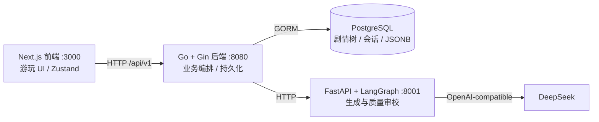

# Story Editor 开发交接手册

> **用途**：帮助新的开发者或 AI 在一次阅读后理解“现在能做什么、代码在哪里、哪些约束不能破、下一步该做什么”。
> **状态快照日期**：2026 年 7 月 28 日。若本手册与运行代码冲突，优先以代码和测试为准，并在修正后同步本手册。

## 1. 一句话定位与当前边界

Story Editor 的长期愿景是“AI 驱动的互动剧情共创社区”：用户既可以游玩，也可以创作、分享和再创作。

**当前 MVP 只验证游玩体验**。已经打通的闭环是：作品 → 匿名会话 → AI 生成 → 状态变化/剧情树 → 回溯与读档。创作辅助 Agent 有接口，但没有 UI；社区路由是桩；前端没有登录。

不要把 [功能设计.md](功能设计.md) 的愿景功能当作已实现功能。当前实现状态应以本手册、`CLAUDE.md` 和代码为准。

## 2. 当前完成度

| 域 | 已完成 | 未完成或限制 |
|---|---|---|
| 用户 | 后端注册、登录、JWT、资料更新、凭证与用户分表 | 前端未接登录；游玩请求默认匿名 guest |
| 作品 | Story CRUD、作品列表、世界观/初始状态 JSON | 创作编辑器、发布管理 UI 未做 |
| 游玩 | 开局、续写、自由输入、回溯、读档、删档、剧情树、状态合并 | 真实环境下的多回合质量/延迟指标尚未沉淀 |
| Agent | LangGraph 生成、属性类型规整、滚动摘要、质量复查与有限重写、**开局+续写全流式(SSE)输出** | RAG、多 Agent fan-out、独立 director/recall/write 子图未做 |
| 前端 | 作品选择、游玩、星图树、历史会话 | 登录、创作、社区、移动端/无障碍/自动化测试未做 |
| 社区 | API 路由与 handler 占位 | 浏览、详情、点赞、评论、搜索、排行榜均未实现 |
| 商业化 | SQL 蓝本中有概念 | 付费、打赏、分成、成就未做 |

## 3. 系统架构与职责



### 3.1 三个进程的硬边界

- **`frontend/`**：只调用 Go 后端的 `/api/v1`，不持有数据库或 DeepSeek 凭证。
- **`backend/`**：唯一的业务编排与持久化入口。负责鉴权、作品/节点/会话、状态合并、Agent HTTP 调用。
- **`agent/`**：无数据库依赖。输入世界观、历史、状态和选择，输出结构化剧情 JSON。质量失败只报错，不写库。

### 3.2 后端分层约定

```text
handler → service → repository
```

- `handler`：绑定/校验 HTTP 请求，调用 service，返回统一信封。
- `service`：业务规则、状态合并、调用 Agent；不绑定 Gin。
- `repository`：仅 GORM 读写。
- `model`：纯数据模型和 DTO 转换，不放业务规则。
- `pkg`：无业务依赖的通用错误、JWT、响应工具。

完整规则在 [`../CLAUDE.md`](../CLAUDE.md)。新增代码不得绕过这条依赖方向。

## 4. 代码地图：从需求找到实现

| 想改什么 | 优先阅读的文件 |
|---|---|
| 后端启动、路由、依赖注入、迁移 | `backend/main.go` |
| 环境变量、DSN、Agent 地址 | `backend/config/config.go`、`backend/.env.example` |
| 游玩业务主流程 | `backend/internal/service/play.go` |
| Agent HTTP 契约 | `backend/internal/service/agent_client.go` |
| 剧情节点、会话、故事模型 | `backend/internal/model/node.go`、`play_session.go`、`story.go` |
| 所有游玩 API 入口 | `backend/internal/handler/play.go` |
| Agent 图和上下文拼接 | `agent/app/graph/story_graph.py` |
| Agent 生成/审校提示词 | `agent/app/prompts.py` |
| Agent 请求响应模型 | `agent/app/schemas.py` |
| Agent 配置 | `agent/app/config.py`、`agent/.env.example` |
| Agent 路由和错误语义 | `agent/app/routers/generate.py`、`assist.py` |
| 前端页面和游玩状态机 | `frontend/app/`、`frontend/store/playStore.ts` |
| 前端 API 信封与类型 | `frontend/lib/api.ts`、`frontend/lib/types.ts`、`frontend/lib/state.ts` |
| 完整设计的 SQL 蓝本 | `infa/sql/users.sql`、`stories.sql`、`play.sql`、`community.sql` |

## 5. 数据模型与不可破坏的约定

### 5.1 当前持久化模型

| 模型 | 关键字段 / 作用 |
|---|---|
| `User` / `UserCredential` | 用户资料与密码/OAuth 凭证分离；密码不出响应 |
| `Story` | 作品元信息；`world_config`、`opening_content`、`price_config` 为 JSON/文本配置 |
| `StoryNode` | 邻接表剧情树。`parent_id`、`depth`、`choice_text`、`content`、`suggested_options`、`state_delta`、`state_snapshot`、`summary` |
| `PlaySession` | 会话归属与当前指针；`current_node_id`、`current_state`、`node_count`、`status` |

`backend/main.go` 目前对 `User`、`UserCredential`、`Story`、`StoryNode`、`PlaySession` 执行 GORM `AutoMigrate`。`infa/sql/` 是更完整的未来蓝本，尤其 `community.sql` 中的表尚未进入运行模型。

### 5.2 状态规则

- `play_sessions.current_state`：会话**当前完整状态的唯一事实来源**。
- `story_nodes.state_delta`：本节点相对父节点的变化，仅用于解释和重建。
- `story_nodes.state_snapshot`：截至本节点的完整快照，服务于回溯/展示。
- `story_nodes.summary`：截至本节点的滚动前情提要，服务于后续续写，不是玩家状态。
- 回溯只移动会话当前节点与状态；既有节点和分支绝不删除。

### 5.3 属性类型

`world_config.attributes` 可声明属性类型；Agent 与 Go 必须使用相同语义：

| 类型 | `state_delta` 形态 | 合并含义 |
|---|---|---|
| `number` | `{"hp": -10}` | 累加 |
| `scalar` | `{"location": "王城"}` | 覆盖 |
| `set` | `{"items": {"add": ["钥匙"], "remove": ["火把"]}}` | 集合增删 |

未声明类型的老数据由 Go 侧兼容推断；不要在 Agent 或前端各自发明不同的合并规则。

## 6. 最重要的运行流程

### 6.1 开局与续写

开局与续写**都走流式**。关键：`StartSession` 只建**空会话**（无根节点、`current_node_id=null`、`node_count=0`），开局正文改由游玩页触发流式生成——这样开局也能逐字流到浏览器（生成发生在游玩页而非首页建会话时）。

```text
前端 POST /play/sessions                      （只建空会话，立即返回，current_node=null）
  → PlayService.StartSession → 建 PlaySession（无根节点）

前端进入游玩页 GET /play/sessions/:id → 发现 current_node=null →
前端 POST /play/sessions/:id/opening/stream   （流式开局，SSE）
  → PlayService.StartOpeningStream（幂等：根节点已存在则直接 done 返回）
  → 无 opening_content：Go 调 Agent POST /generate/stream 真逐字流式
    有 opening_content：正文作单帧 delta + POST /opening/complete 补选项/summary
  → 流结束建根 StoryNode + 回填 current_node_id/node_count=1
  → done 帧携带持久化后的 SessionResult

前端 POST /play/sessions/:id/choice/stream     （流式续写，SSE；旧的非流式 /choice 仍在）
  → PlayService.MakeChoiceStream
  → loadChoiceContext：回溯出 history（带 summary）
  → Go 调 Agent POST /continue/stream，SSE 逐帧转发给前端：
       delta（正文增量）/ revise（审校拒绝，前端清空重来）
  → 流结束拿到完整 AIResult 后 applyContinueResult：
       合并 state_delta → 同层语义合并去重 → 未命中才新建 StoryNode → 更新会话
  → done 帧携带持久化后的 SessionResult
```

流式与审校共存（真流式·单次哨兵分隔）：Agent `generate` 单次输出「正文 `<<<META>>>` JSON尾」，正文逐字流出，结束后解析尾部；尾缺失/非法用 structurer 兜底；再跑 review，拒绝则发 revise 并带反馈重来（上限同 `AI_REVIEW_MAX_RETRIES`）。落库/去重/合并只能在流结束后做（依赖完整 delta/options）。前端游玩页 `load()` 见 `current_node=null` 即触发 `startOpening()`，有按 sessionId 的去重守卫防严格模式双触发。

### 6.2 Agent 质量闭环

```text
prepare
  → generate（剧情、选项、state_delta、summary）
  → review（低温 AI 审查）
       ├─ passed=true  → normalize → 返回
       └─ passed=false → 把 issues 附回 generate，完整重写
```

`AI_REVIEW_MAX_RETRIES` 默认是 `2`：最多初稿加两次重写。每一稿都必须通过审校；超出上限会抛异常，`agent/app/routers/generate.py` 将其转换为 HTTP 502。因此未审校通过的内容不会持久化为剧情节点。

审校涉及：世界观/历史/状态/选择的承接，正文推进，属性入戏，选项差异及后果提示，`state_delta` 和 `summary` 的一致性，结局自洽。

### 6.3 长程记忆

续写优先注入：**最近一条非空 `summary` + 最近两段原文 + 当前状态/选择**。这让上下文长度与剧情深度近似无关；老会话无摘要时回退为“开局 + 最近窗口”的滑动窗口。详细方案见 [剧情上下文构建方案.md](剧情上下文构建方案.md)。

## 7. 对外接口地图

所有 Go API 的根路径为 `/api/v1`，响应信封统一为：

```json
{"success": true, "data": {}, "error": null, "meta": null}
```

### 7.1 Go 后端

| 域 | 接口 |
|---|---|
| 鉴权 | `POST /auth/register`、`POST /auth/login`、`GET/PUT /auth/profile` |
| 作品/节点 | `POST/GET /stories`、`GET/PUT/DELETE /stories/:id`、`POST /stories/:id/nodes`、`GET /nodes/:id/children`、`PUT/DELETE /nodes/:id` |
| 游玩 | `POST /play/sessions`（建空会话）、`POST /play/sessions/:id/opening/stream`（SSE 流式开局，幂等）、`GET /play/sessions`、`GET/DELETE /play/sessions/:id`、`POST /play/sessions/:id/choice`、`POST /play/sessions/:id/choice/stream`（SSE 流式续写）、`POST /play/sessions/:id/backtrack` |
| 社区（未实现） | `GET /community/stories`、`GET /community/stories/:id`、`POST /community/stories/:id/like`、`POST /community/stories/:id/comments` |

鉴权路由之外的游玩接口允许匿名访问；当前前端使用后端启动时确保存在的 guest 用户。若接入前端登录，必须首先检查会话的用户过滤、JWT 传递和 guest 迁移策略。

### 7.2 Agent 服务

| 接口 | 作用 |
|---|---|
| `POST /generate` | 生成开场剧情（非流式） |
| `POST /continue` | 根据路径、状态和玩家行动续写（非流式，仍保留） |
| `POST /continue/stream` `POST /generate/stream` | 流式生成：SSE `delta`/`revise`/`done`/`error` 帧（`done` 携带完整 AIResult） |
| `POST /opening/complete` | 为已写定的开场正文补起始选项 + summary（预设 opening_content 的作品） |
| `POST /merge-check` | 在 Go 的 `state_delta` 硬过滤之后判断同层候选是否语义等价 |
| `POST /assist/world`、`/opening`、`/polish`、`/branches` | 创作辅助；暂无前端消费者 |
| `GET /health` | 检查模型配置状态 |

Agent 的开场和续写响应统一包含：`content`、`options`、`state_delta`、`summary`、`is_ending`、`ending_type`。详见 [`../agent/README.md`](../agent/README.md)。

## 8. 本地运行、测试与真实验收

### 8.1 配置

| 进程 | 示例文件 | 必要项 |
|---|---|---|
| Agent | `agent/.env.example` | `DEEPSEEK_API_KEY` |
| 后端 | `backend/.env.example` | 可达 PostgreSQL、`DB_*`、`JWT_SECRET`、`AGENT_URL` |
| 前端 | `frontend/.env.local.example` | 可选 `NEXT_PUBLIC_API_BASE` |

推荐执行 `./scripts/dev.ps1`。注意后端必须以 `backend/` 为工作目录运行：模板路径和配置搜索路径依赖该目录。

### 8.2 已有自动验证

```powershell
cd backend
go test ./...

cd ..\agent
.\.venv\Scripts\python.exe -m compileall -q app tests
.\.venv\Scripts\python.exe -m unittest discover -s tests -v
```

当前 Python 测试覆盖“审校拒绝后带反馈重写”和“超过上限绝不交付未通过内容”。Go 已有 `play_merge_test.go` 覆盖节点语义合并。

### 8.3 必做的人工验收

自动测试不能证明叙事好玩。每次修改 Agent 提示、上下文、质量规则或状态合并后，至少要：

1. 运行真实 Agent、后端和前端；
2. 连续游玩多回合，并回溯后开新分支；
3. 检查属性显示、状态变化、节点树、读档是否一致；
4. 检查摘要是否遗漏/篡改伏笔和人物关系；
5. 记录审校重写次数与耗时，避免质量循环把体验拖垮。

## 9. 当前风险、技术债与优先级

### 9.1 最高优先级：先量化游玩留存体验

下一位开发者不要直接上社区或支付，应先跑真实多回合样本并记录指标。

**已就绪的埋点**（`agent/app/graph/story_graph.py`）：

- **每次生成流一行 `gen`**（`_invoke_with_metrics`）：`mode`、`outcome`、`elapsed_ms`(完整回复耗时)、成功时附 `review_failures`(交付前被拒次数，0=首稿通过)/`first_draft_pass`/`is_ending`，失败时附 `err_type`/`detail`。`outcome` 已细分：`ok` / `parse_error`(LLM 非法 JSON，`LLMParseError`) / `review_exhausted`(审校超限，`ReviewExhaustedError`) / `error`(其它)——两类失败要分开看：前者是解析/重试问题，后者是提示词/门槛问题。
- **每次审校判定一行 `review`**（`review` 节点）：`verdict`(pass/reject)、`attempt`、拒绝时附 `issues`。用来回答「审校到底在拒什么、是不是形同橡皮图章」，这是 `gen` 行的通过率无法单独回答的。

刻意不建管理端大屏/指标表——验证期用日志聚合即可（`agent/tools/sample_metrics.py` 进程内直驱 `run_start/run_continue` 并聚合，不经 HTTP、不碰 DB，避免 uvicorn 默认配置吞掉 INFO）。等社区上线、指标从"验证一次"变成"每天要看"且鉴权就绪后再考虑大屏。

由此可直接算出：

- 首稿审校通过率(`first_draft_pass=True` 占比)、每局平均重写次数(`review_failures` 均值)、审校拒绝率(`review` 行 reject 占比)；
- 完整回复延迟与 p95(`elapsed_ms`)；流式续写另打 `stream=1` 与 **`ttfb_ms`（首字延迟）**——实测约 1.5s（vs 完整 ~7.7s）。注意 `app/main.py` 已给 `story.metrics` 挂 handler，否则 uvicorn 默认吞掉 INFO 埋点；
- 报错率并按 `parse_error` / `review_exhausted` 细分。

仍需人工观察、日志无法覆盖的：

- 摘要漂移、人物/伏笔矛盾、选择无后果等案例；
- 回溯后分支的状态与叙事一致性。

### 9.2 已知技术债

- 质量审校是同一模型的二次调用，能提升下限但不能保证事实正确；可能增加延迟和费用。真实样本显示审校**并非橡皮图章**：拒绝率约 18%，命中的多是「`state_delta` 与正文不一致 / `summary` 漏记新增实体 / 选项 hint 无后果」——正是留存杀手。这些高频拒因应反哺生成提示词以提升首稿通过率、降低延迟（P1）。
- LLM 偶发返回非法 JSON（真实样本约 7%），过去直接冒泡成玩家 502。现 `chat_json` 对 `LLMParseError` 附纠正指令重试 `AI_PARSE_MAX_RETRIES`(默认1) 次并打 `parse_retry` 点；耗尽仍抛。重试后仍高发时再考虑修复 JSON 或换更稳的解析。
- `summary` 是有损压缩，长剧情仍可能漂移；RAG 是后续补精确细节的方案。
- 前端没有登录，后端已有的真实用户边界尚未被游玩 UI 验证。
- `community` 路由已注册但 handler 未实现；不能把它作为可用接口依赖。
- `AutoMigrate` 适合当前 Demo，不等同于生产级迁移治理。
- Go 服务的上下文传递、优雅关闭、seed 开关等工程化问题仍在 [功能设计.md](功能设计.md) 的开放问题中记录。

### 9.3 建议的后续顺序

1. **试玩与观测**：补 Agent/PlayService 回归测试、埋点或日志，跑真实多回合样本。
2. **Agent 阶段二的最小切片**：依据数据选择先拆 director、先补 recall/RAG，或先做 SSE 流式反馈；不要一次完成完整多 Agent。
3. **真实身份接入前端**：让会话、作品和后续社区具备明确归属。
4. **创作前端**：消费已存在的 `/assist/*`，打通“创作 → 游玩”。
5. **社区 MVP**：发布、浏览、详情、点赞/评论；随后才考虑付费与成就。

## 10. 文档维护规则

| 文档 | 应记录什么 | 何时更新 |
|---|---|---|
| `README.md` | 项目入口、架构、当前概览、快速启动 | 主链路/入口/优先级变化 |
| 本手册 | 现状、边界、文件入口、交接风险、验证方式 | 任一模块状态或契约变化 |
| `CLAUDE.md` | 开发规范、分层边界、精确实现约定 | 修改工程规则、模块状态、运行方式 |
| 模块 README | 模块接口、配置、目录、测试 | 修改模块契约/流程/配置 |
| `docs/设计思路.md` | 技术选择、演进和权衡 | 修改架构/数据/Agent 方案 |
| `docs/功能设计.md` | 产品愿景、范围、开放决策 | 修改产品目标或优先级 |
| `infa/sql/` | 完整数据模型设计 | 新增持久化模块或改变长期 schema |

**完成代码任务不等于完成交付。** 涉及当前行为、配置、接口、数据字段或优先级的改动，至少更新本手册和对应模块 README；必要时同步设计文档与 `CLAUDE.md`。

## 11. 接手第一天检查清单

- [ ] 先阅读本手册、`CLAUDE.md` 和目标模块 README。
- [ ] 查看 `git status`，区分前人未提交改动与本次改动，不覆盖未知修改。
- [ ] 复制三份示例环境文件，确认 PostgreSQL 和 DeepSeek 配置。
- [ ] 跑 Go 测试与 Agent 离线测试。
- [ ] 用 `scripts/dev.ps1` 启动三进程，完成一次开局、续写、回溯、读档的人工冒烟。
- [ ] 开始新功能前，先确认它属于“当前游玩留存优先级”还是未来愿景，避免跳过关键验证。
